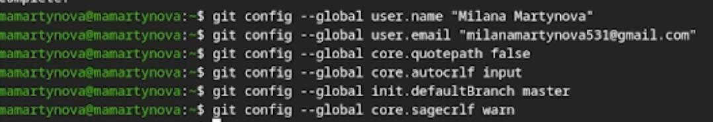
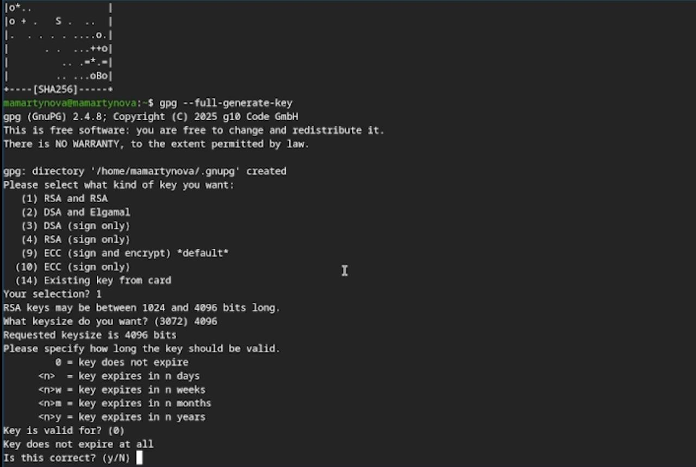
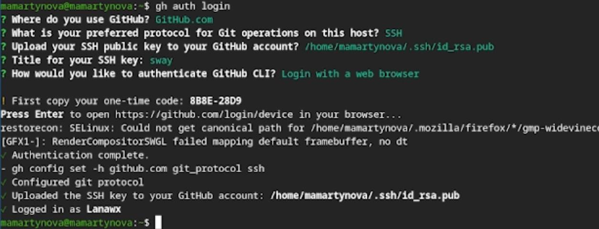
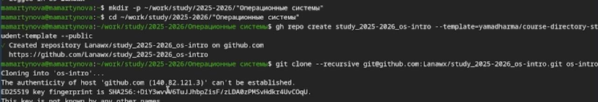
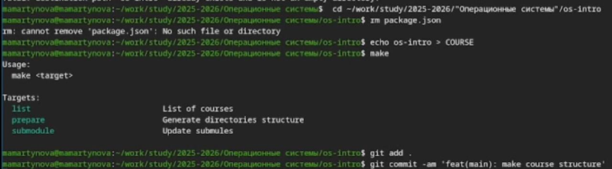

---
## Front matter
lang: ru-RU
title: Лабораторная работа №1
subtitle: Операционные системы
author:
  - Мартынова М.А.
institute:
  - Российский университет дружбы народов, Москва, Россия
date: 24 февраля 2026

## i18n babel
babel-lang: russian
babel-otherlangs: english

## Formatting pdf
toc: false
toc-title: Содержание
slide_level: 2
aspectratio: 169
section-titles: true
theme: default
mainfont: Times New Roman
sansfont: Arial
---

# Информация

## Докладчик

:::::::::::::: {.columns align=center}
::: {.column width="70%"}

  * Мартынова Милана Александровна
  * Студент НКАбд-04-25
  * Российский университет дружбы народов
  * [1032253522@rudn.ru](mailto:1032253522@rudn.ru)

:::

::::::::::::::

# 1. Цель работы

Цель работы заключается в теоретическом изучении концепций систем контроля версий и формировании практических навыков эффективного использования инструментария Git.

# 2. Задание

- Создать базовую конфигурацию для работы с git.
- Создать ключ SSH.
- Создать ключ PGP.
- Настроить подписи git.
- Зарегистрироваться на Github.
- Создать локальный каталог для выполнения заданий по предмету.

# 3. Теоретическое введение

Системы контроля версий (VCS) используются для совместной работы над проектами. Проект хранится в репозитории, а VCS позволяет фиксировать изменения, совмещать правки разных участников и возвращаться к более ранним версиям.

В централизованных VCS (например, CVS, Subversion) есть единый сервер-репозиторий. Пользователь получает нужную версию файлов, работает с ней и отправляет изменения обратно. Сервер хранит всю историю правок и для экономии места может применять дельта-компрессию (сохранять только изменения между версиями).
VCS также отслеживают конфликты при одновременной работе с файлом и позволяют их разрешать (слияние, ручной выбор, отмена или блокировка файла). Дополнительные возможности: поддержка ветвления (несколько версий одного файла с общей историей) и детальный журнал изменений с информацией об авторе и времени правок.
В распределённых системах (Git, Mercurial) центральный репозиторий не обязателен.

# 4. Выполнение лабораторной работы

Сначала произвожу базовую настройку git. (рис. 1)

{#fig:001 width=70%}

---

Далее создаю ssh и gpg ключи.  (рис. 2)

{#fig:002 width=70%}

---

Экспортирую gpg ключ для авторизации на github. (рис. 3)

{#fig:003 width=70%}

---

Настраиваю автоматические подписи для коммитов.  (рис. 4)

{#fig:004 width=70%}

---

Авторизуюсь на github для работы через терминал.  (рис. 5)

{#fig:005 width=70%}

---

Создаю директорию курса по шаблону(рис. 6)

{#fig:006 width=70%}

---

В конце настраиваю рабочую директорию  (рис. 7)

{#fig:007 width=70%}

# 5. Выводы

В ходе выполнения лабораторной работы были освоены практические навыки работы с Git: создание и настройка репозиториев, генерация SSH и GPG-ключей, а также выполнение первичной настройки каталога курса и авторизация в GitHub.