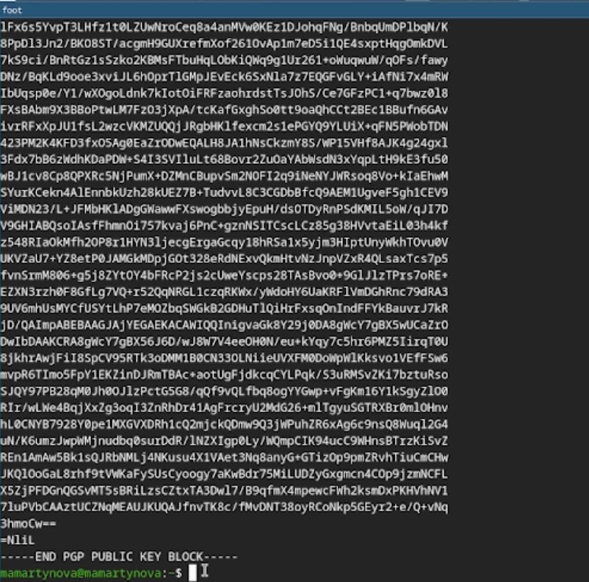
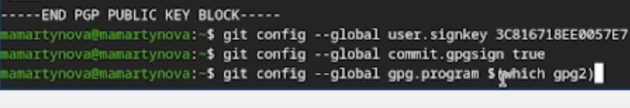

---
## Front matter
title: "Лабораторная работа №2"
author: "Мартынова Милана Александровна"

## Generic options
lang: ru-Ru\
toc-title: "Содержание"

## Bibliography
bibliography: bib/cite.bib
csl: pandoc/csl/gost-r-7-0-5-2008-numeric.csl

## Pdf output format
toc: true # Table of contents
toc-depth: 2
lof: true # List of figures
lot: true # List of tables
fontsize: 12pt
linestretch: 1.5
papersize: a4
documentclass: scrreprt
## I18n polyglossia
polyglossia-lang:
   name: russian
   options:
   - spelling=modern
   - babelshorhands=true
polyglossia-otherlangs:
   name: english
## I18n babel
babel-lang: russian
babel-otherlangs: english
## Fonts
## Fonts
mainfont: Times New Roman
sansfont: Arial
monofont: Courier New
mathfont: Times New Roman
## Biblatex
biblatex: true
biblio-style: "gost-numeric"
biblatexoptions:
   - parentracker=true
   - backend=biber
   - hyperref=auto
   - language=auto
   - autolang=other*
   - citestyle=gost-numeric
## Pandoc-crossref LaTeX customization
figureTitle: "Рис."
tableTitle: "Таблица"
listingTitle: "Листинг"
lofTitle: "Список иллюстраций"
lotTitle: "Список таблиц"
lolTitle: "Листинги"
## Misc options  
indent: true
header-includes:
  - \usepackage{indentfirst}
  - \usepackage{float} # keep figures where there are in the text
  - \floatplacement{figure}{H} # keep figures where there are in the text
---

# 1. Цель работы

Цель работы заключается в теоретическом изучении концепций систем контроля версий и формировании практических навыков эффективного использования инструментария Git.

# 2. Задание

- Создать базовую конфигурацию для работы с git.
- Создать ключ SSH.
- Создать ключ PGP.
- Настроить подписи git.
- Зарегистрироваться на Github.
- Создать локальный каталог для выполнения заданий по предмету.

# 3. Теоретическое введение

Системы контроля версий (VCS) используются для совместной работы над проектами. Проект хранится в репозитории, а VCS позволяет фиксировать изменения, совмещать правки разных участников и возвращаться к более ранним версиям.

В централизованных VCS (например, CVS, Subversion) есть единый сервер-репозиторий. Пользователь получает нужную версию файлов, работает с ней и отправляет изменения обратно. Сервер хранит всю историю правок и для экономии места может применять дельта-компрессию (сохранять только изменения между версиями).
VCS также отслеживают конфликты при одновременной работе с файлом и позволяют их разрешать (слияние, ручной выбор, отмена или блокировка файла). Дополнительные возможности: поддержка ветвления (несколько версий одного файла с общей историей) и детальный журнал изменений с информацией об авторе и времени правок.
В распределённых системах (Git, Mercurial) центральный репозиторий не обязателен.

# 4. Выполнение лабораторной работы

Сначала произвожу базовую настройку git. (рис. 1)

{#fig:001 width=70%}

Далее создаю ssh и gpg ключи.  (рис. 2)

{#fig:002 width=70%}

Экспортирую gpg ключ для авторизации на github. (рис. 3)

{#fig:003 width=70%}

Настраиваю автоматические подписи для коммитов.  (рис. 4)

{#fig:004 width=70%}

Авторизуюсь на github для работы через терминал.  (рис. 5)

{#fig:005 width=70%}

Создаю директорию курса по шаблону(рис. 6)

{#fig:006 width=70%}

В конце настраиваю рабочую директорию  (рис. 7)

{#fig:007 width=70%}

# 5. Выводы

В ходе выполнения лабораторной работы были освоены практические навыки работы с Git: создание и настройка репозиториев, генерация SSH и GPG-ключей, а также выполнение первичной настройки каталога курса и авторизация в GitHub.

# Список литературы{.unnumbered}

::: {#refs}
:::