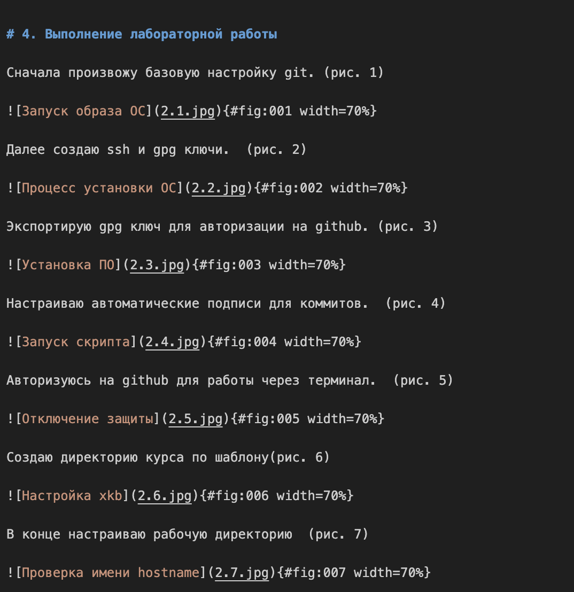

---
## Front matter
lang: ru-RU
title: Лабораторная работа №3
subtitle: Операционные системы
author:
  - Мартынова М.А.
institute:
  - Российский университет дружбы народов, Москва, Россия
date: 24 февраля 2026

## i18n babel
babel-lang: russian
babel-otherlangs: english

## Formatting pdf
toc: false
toc-title: Содержание
slide_level: 2
aspectratio: 169
section-titles: true
theme: default
mainfont: Times New Roman
sansfont: Arial
---

# Информация

## Докладчик

:::::::::::::: {.columns align=center}
::: {.column width="70%"}

  * Мартынова Милана Александровна
  * Студент НКАбд-04-25
  * Российский университет дружбы народов
  * [1032253522@rudn.ru](mailto:1032253522@rudn.ru)

:::

::::::::::::::

# 1. Цель работы

Приобретение навыков подготовки отчетов с использованием языка разметки Markdown.

# 2. Задание

- Сделайте отчёт по предыдущей лабораторной работе в формате Markdown.
- В качестве отчёта просьба предоставить отчёты в 3 форматах: pdf, docx и md(в архиве, поскольку он должен содержать скриншоты, Makefile и т.д.)

# 3. Теоретическое введение

Чтобы создать заголовок, используйте знак ( # ). Чтобы задать для текста полужирное начертание, заключите его в двойные звездочки, а для курсивного — в одинарные. Полужирное и курсивное начертание одновременно задается тройными звездочками. Блоки цитирования создаются с помощью символа >. Неупорядоченный (маркированный) список можно отформатировать с помощью звездочек или тире, а упорядоченный — с помощью соответствующих цифр. Чтобы вложить один список в другой, добавьте отступ для элементов дочернего списка. Синтаксис Markdown для встроенной ссылки состоит из части [link text], представляющей текст гиперссылки, и части (file-name.md) — URL-адреса или имени файла, на который дается ссылка. Markdown поддерживает как встраивание фрагментов кода в предложение, так и их размещение между предложениями в виде отдельных огражденных блоков. Внутритекстовые формулы делаются аналогично формулам LaTeX. Для обработки файлов в формате Markdown используется Pandoc, а также pandoc-citeproc и pandoc-crossref. Преобразовать файл README.md можно командой pandoc README.md -o README.pdf для создания PDF или pandoc README.md -o README.docx для создания документа Word. Для автоматизации можно использовать Makefile со следующим содержимым: FILES = $(patsubst %.md, %.docx, $(wildcard *.md)) и FILES += $(patsubst %.md, %.pdf, $(wildcard *.md).

# 4. Выполнение лабораторной работы

Указываю основную информацию о лабораторной работе. (рис. 1)

{#fig:001 width=70%}

---

Формирую цель работы, задание и заполняю теоретическое введение. (рис. 2)

{#fig:002 width=70%}

---

Описываю процесс выполнения лабораторной работы. (рис. 3)

{#fig:003 width=70%}

# 5. Выводы

В результате выполнения лабораторной работы были освоены принципы оформления отчетов с использованием языка разметки Markdown.
