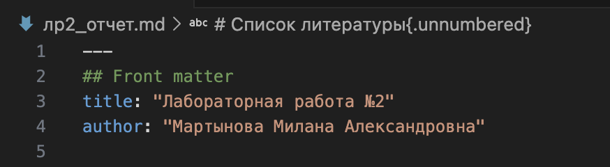
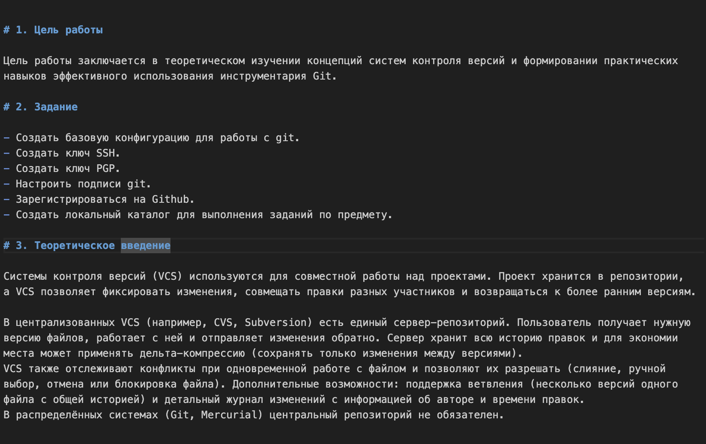

---
## Front matter
title: "Лабораторная работа №3"
author: "Мартынова Милана Александровна"

## Generic options
lang: ru-Ru\
toc-title: "Содержание"

## Bibliography
bibliography: bib/cite.bib
csl: pandoc/csl/gost-r-7-0-5-2008-numeric.csl

## Pdf output format
toc: true # Table of contents
toc-depth: 2
lof: true # List of figures
lot: true # List of tables
fontsize: 12pt
linestretch: 1.5
papersize: a4
documentclass: scrreprt
## I18n polyglossia
polyglossia-lang:
   name: russian
   options:
   - spelling=modern
   - babelshorhands=true
polyglossia-otherlangs:
   name: english
## I18n babel
babel-lang: russian
babel-otherlangs: english
## Fonts
## Fonts
mainfont: Times New Roman
sansfont: Arial
monofont: Courier New
mathfont: Times New Roman
## Biblatex
biblatex: true
biblio-style: "gost-numeric"
biblatexoptions:
   - parentracker=true
   - backend=biber
   - hyperref=auto
   - language=auto
   - autolang=other*
   - citestyle=gost-numeric
## Pandoc-crossref LaTeX customization
figureTitle: "Рис."
tableTitle: "Таблица"
listingTitle: "Листинг"
lofTitle: "Список иллюстраций"
lotTitle: "Список таблиц"
lolTitle: "Листинги"
## Misc options  
indent: true
header-includes:
  - \usepackage{indentfirst}
  - \usepackage{float} # keep figures where there are in the text
  - \floatplacement{figure}{H} # keep figures where there are in the text
---

# 1. Цель работы

Приобретение навыков подготовки отчетов с использованием языка разметки Markdown.

# 2. Задание

- Сделайте отчёт по предыдущей лабораторной работе в формате Markdown.
- В качестве отчёта просьба предоставить отчёты в 3 форматах: pdf, docx и md(в архиве, поскольку он должен содержать скриншоты, Makefile и т.д.)

# 3. Теоретическое введение

Чтобы создать заголовок, используйте знак ( # ). Чтобы задать для текста полужирное начертание, заключите его в двойные звездочки, а для курсивного — в одинарные. Полужирное и курсивное начертание одновременно задается тройными звездочками. Блоки цитирования создаются с помощью символа >. Неупорядоченный (маркированный) список можно отформатировать с помощью звездочек или тире, а упорядоченный — с помощью соответствующих цифр. Чтобы вложить один список в другой, добавьте отступ для элементов дочернего списка. Синтаксис Markdown для встроенной ссылки состоит из части [link text], представляющей текст гиперссылки, и части (file-name.md) — URL-адреса или имени файла, на который дается ссылка. Markdown поддерживает как встраивание фрагментов кода в предложение, так и их размещение между предложениями в виде отдельных огражденных блоков. Внутритекстовые формулы делаются аналогично формулам LaTeX. Для обработки файлов в формате Markdown используется Pandoc, а также pandoc-citeproc и pandoc-crossref. Преобразовать файл README.md можно командой pandoc README.md -o README.pdf для создания PDF или pandoc README.md -o README.docx для создания документа Word. Для автоматизации можно использовать Makefile со следующим содержимым: FILES = $(patsubst %.md, %.docx, $(wildcard *.md)) и FILES += $(patsubst %.md, %.pdf, $(wildcard *.md).

# 4. Выполнение лабораторной работы

Указываю основную информацию о лабораторной работе. (рис. 1)

{#fig:001 width=70%}

Формирую цель работы, задание и заполняю теоретическое введение. (рис. 2)

{#fig:002 width=70%}

Описываю процесс выполнения лабораторной работы. (рис. 3)

{#fig:003 width=70%}

# 5. Выводы

В результате выполнения лабораторной работы были освоены принципы оформления отчетов с использованием языка разметки Markdown.

# Список литературы{.unnumbered}

::: {#refs}
:::