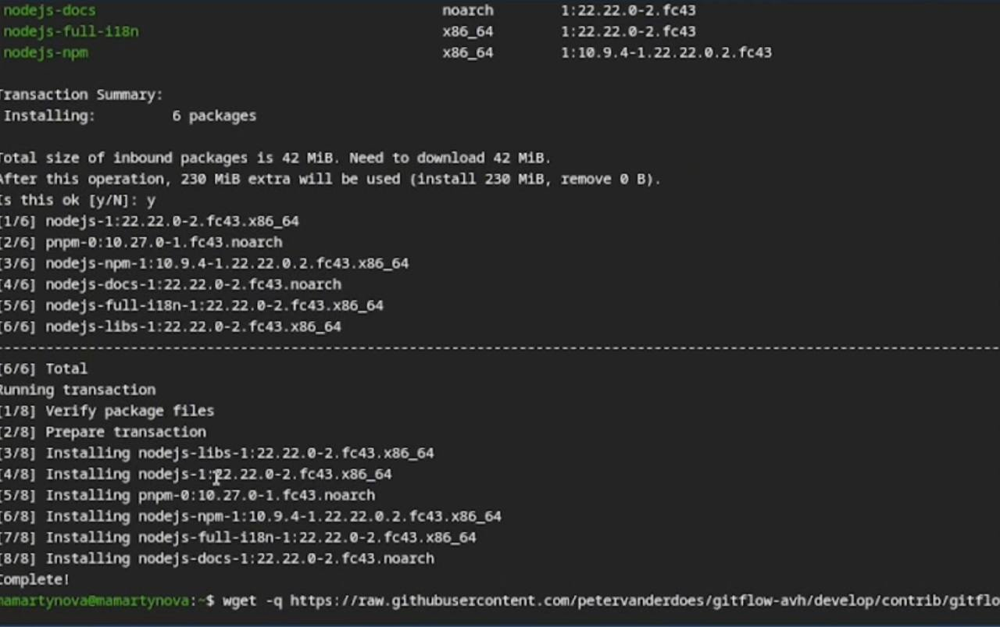
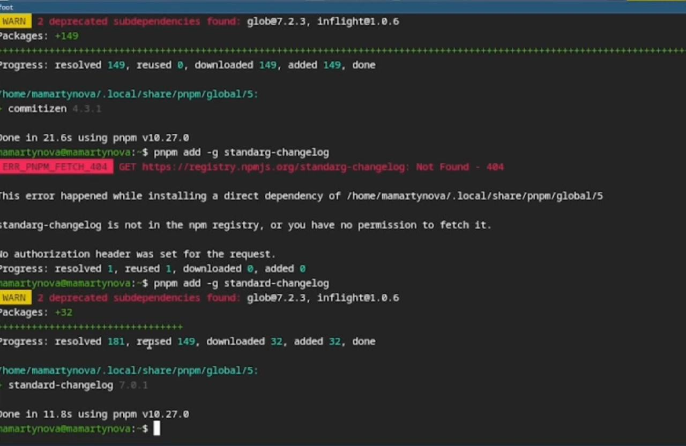
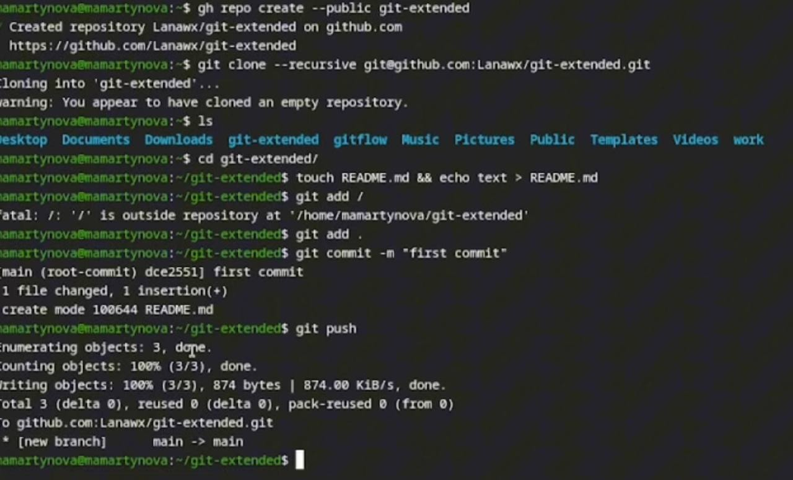
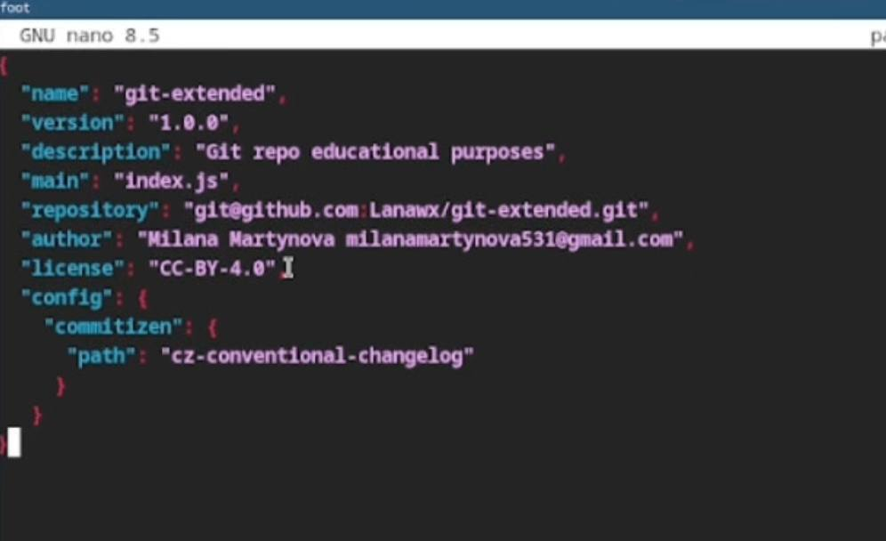
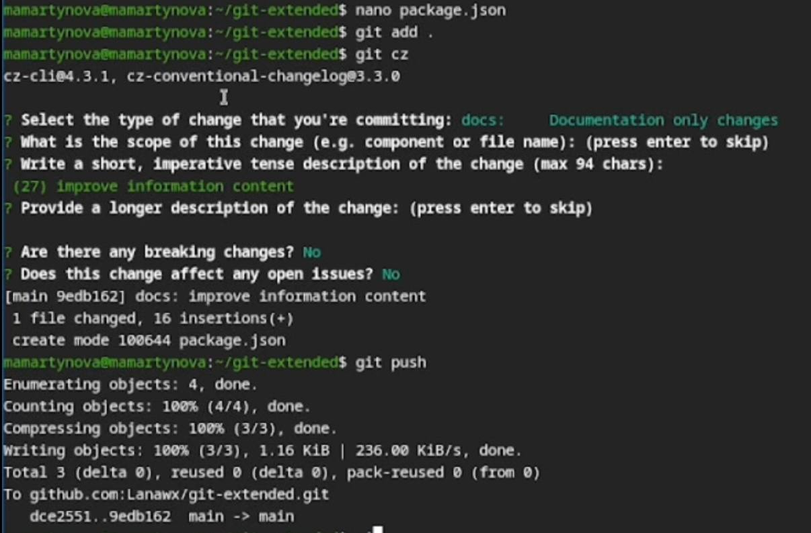
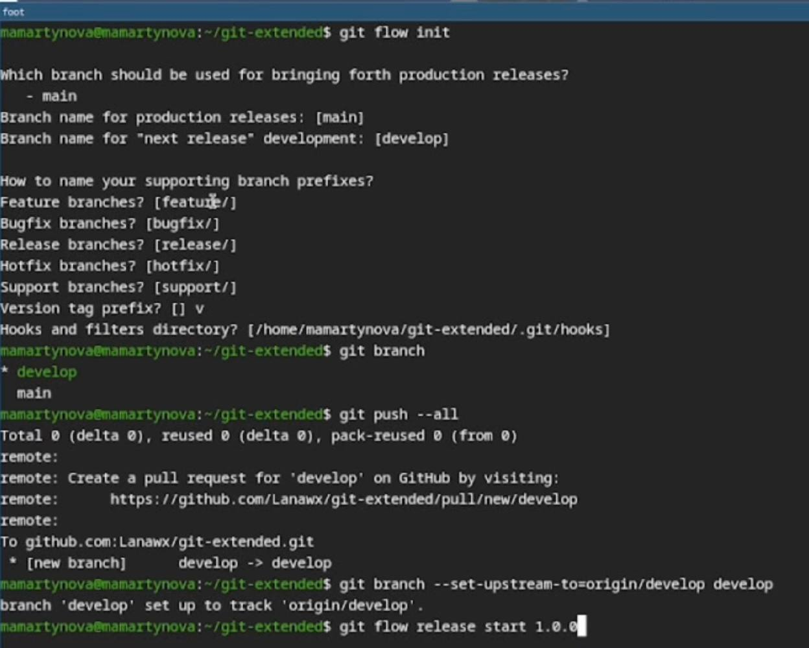
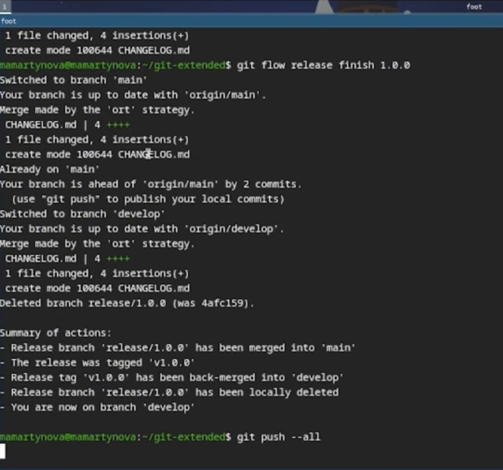
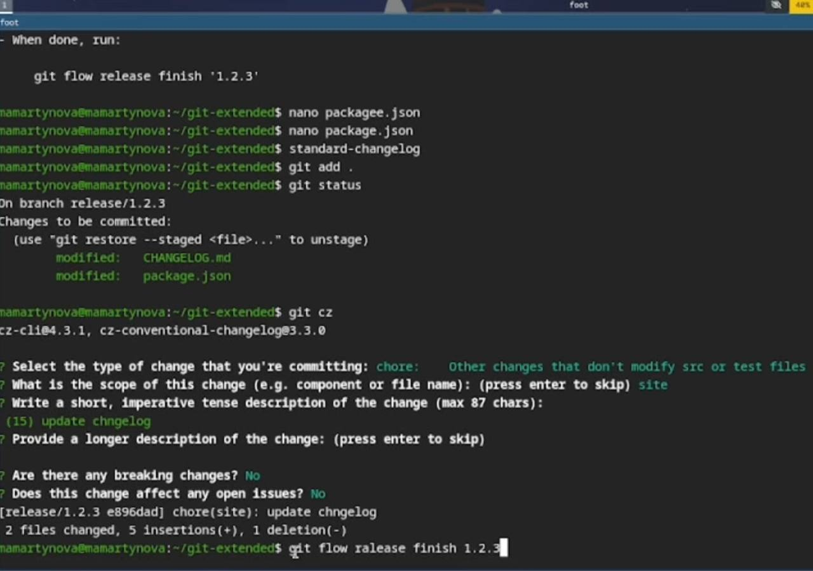

---
## Front matter
title: "Лабораторная работа №4"
author: "Мартынова Милана Александровна"

## Generic options
lang: ru-Ru\
toc-title: "Содержание"

## Bibliography
bibliography: bib/cite.bib
csl: pandoc/csl/gost-r-7-0-5-2008-numeric.csl

## Pdf output format
toc: true # Table of contents
toc-depth: 2
lof: true # List of figures
lot: true # List of tables
fontsize: 12pt
linestretch: 1.5
papersize: a4
documentclass: scrreprt
## I18n polyglossia
polyglossia-lang:
   name: russian
   options:
   - spelling=modern
   - babelshorhands=true
polyglossia-otherlangs:
   name: english
## I18n babel
babel-lang: russian
babel-otherlangs: english
## Fonts
## Fonts
mainfont: Times New Roman
sansfont: Arial
monofont: Courier New
mathfont: Times New Roman
## Biblatex
biblatex: true
biblio-style: "gost-numeric"
biblatexoptions:
   - parentracker=true
   - backend=biber
   - hyperref=auto
   - language=auto
   - autolang=other*
   - citestyle=gost-numeric
## Pandoc-crossref LaTeX customization
figureTitle: "Рис."
tableTitle: "Таблица"
listingTitle: "Листинг"
lofTitle: "Список иллюстраций"
lotTitle: "Список таблиц"
lolTitle: "Листинги"
## Misc options  
indent: true
header-includes:
  - \usepackage{indentfirst}
  - \usepackage{float} # keep figures where there are in the text
  - \floatplacement{figure}{H} # keep figures where there are in the text
---

# 1. Цель работы

Освоение продвинутых методов работы с git-репозиториями и механизмами создания релизов.

# 2. Задание

- Выполнить работу для тестового репозитория.
- Преобразовать рабочий репозиторий в репозиторий с git-flow и conventional commits.

# 3. Теоретическое введение

Gitflow Workflow, опубликованная Винсентом Дриссеном, предполагает строгую модель ветвления с учетом выпуска проекта и включает создание отдельной ветки для исправления ошибок в рабочей среде. Семантическое версионирование (SemVer) задается в формате МАЖОРНАЯ.МИНОРНАЯ.ПАТЧ, где мажорная версия увеличивается при несовместимых изменениях API, минорная — при добавлении новой обратно совместимой функциональности, а патч-версия — при обратно совместимых исправлениях. Conventional Commits — это соглашение о структуре сообщений коммитов, которое тесно связано с SemVer и регламентирует основные типы коммитов.

# 4. Выполнение лабораторной работы

Устанавливаю nodejs, пакетный менеджер для него pnpm и gitflow. (рис. 1)

{#fig:001 width=70%}

Устаналиваю через pnpm commitizen и standard-changelog.(рис. 2)

{#fig:002 width=70%}

Создаю новый репозиторий и делаю там первый коммит. (рис. 3)

{#fig:003 width=70%}

Инициализирую и конфигурирую общепринятые коммиты в созданной директории через редактирование package.json.(рис. 4)

{#fig:004 width=70%}

Делаю снимок измененний, создаю коммит и отправляю на удаленный репозиторий. (рис. 5)

{#fig:005 width=70%}

Инициализирую в репозитории git flow и создаю 1 релиз в только что созданной ветке develop. (рис. 6)

{#fig:006 width=70%}

Создаю список изменений через standard changelog, заканчиваю релиз и выгружаю на удаленный репозиторий изменения. (рис. 7)

{#fig:007 width=70%}

Инициализирую ветку feature для работы над новой функциональностью, готовлю релиз и загружаю на github. (рис. 8)

{#fig:008 width=70%}

# 5. Выводы

В результате выполнения лабораторной работы были освоены навыки корректной работы с git-репозиториями.

# Список литературы{.unnumbered}

::: {#refs}
:::