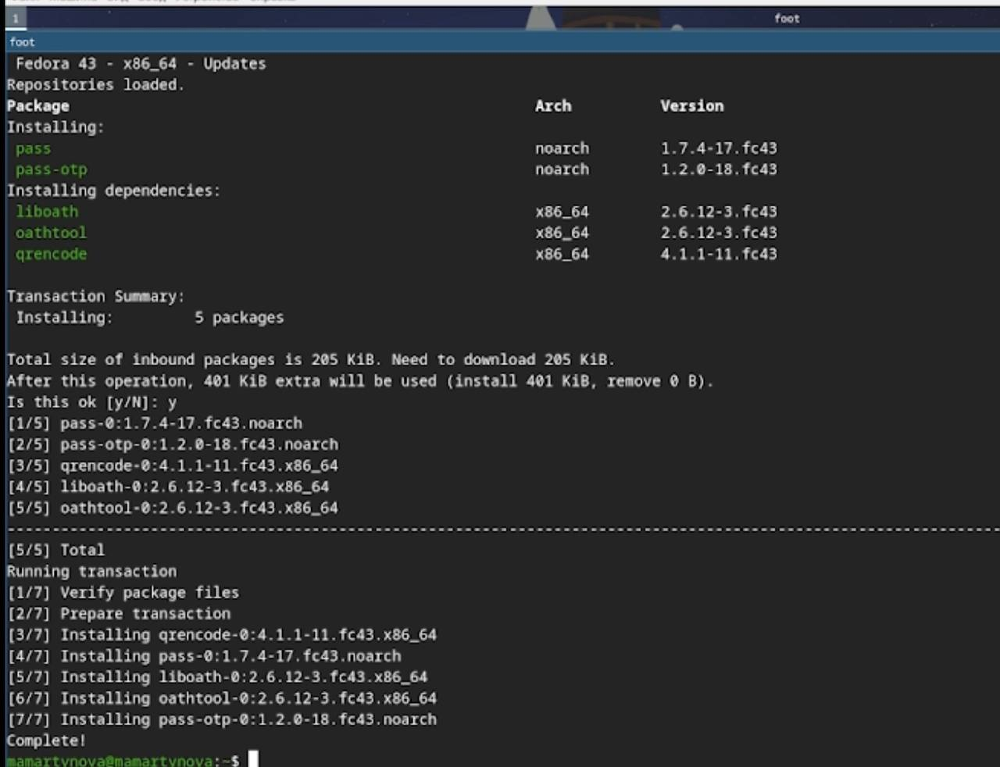
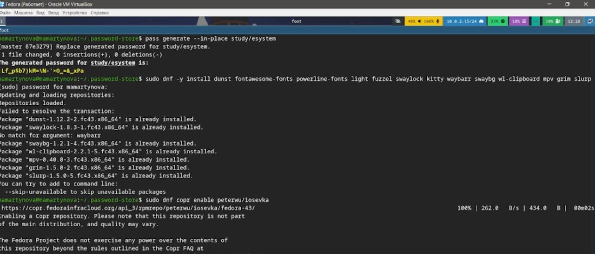
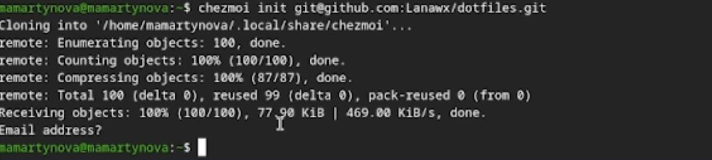
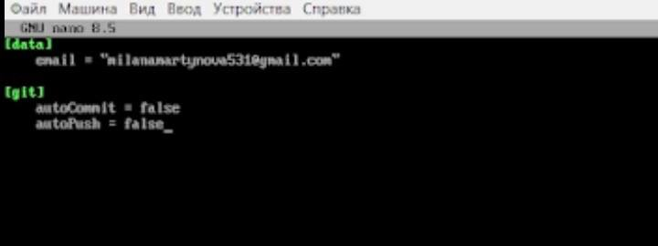

---
## Front matter
lang: ru-RU
title: Лабораторная работа №5
subtitle: Операционные системы
author:
  - Мартынова М.А.
institute:
  - Российский университет дружбы народов, Москва, Россия
date: 13 марта 2026

## i18n babel
babel-lang: russian
babel-otherlangs: english

## Formatting pdf
toc: false
toc-title: Содержание
slide_level: 2
aspectratio: 169
section-titles: true
theme: default
mainfont: Times New Roman
sansfont: Arial
---

# Информация

## Докладчик

:::::::::::::: {.columns align=center}
::: {.column width="70%"}

  * Мартынова Милана Александровна
  * Студент НКАбд-04-25
  * Российский университет дружбы народов
  * [1032253522@rudn.ru](mailto:1032253522@rudn.ru)

:::

::::::::::::::

# 1. Цель работы

Изучить и освоить работу с инструментами pass, gopass и chezmoi, а также механизм Native Messaging. Настроить их синхронизацию с удаленным Git-репозиторием.

# 2. Задание

- Установить дополнительное ПО
- Установить и настроить pass
- Настроить интерфейс с браузером
- Сохранить пароль
- Установить и настроить chezmoi
- Настроить chezmoi на новой машине
- Выполнить ежедневные операции с chezmoi

# 3. Теоретическое введение

pass реализует простой, но надежный подход Unix: пароли хранятся в виде набора зашифрованных GPG-файлов, разложенных по папкам. Это дает свободу в организации структуры паролей, но если вы планируете использовать сторонние графические оболочки или расширения, структуру нужно продумывать заранее.
chezmoi решает проблему синхронизации настроек (dotfiles). Он хранит эталонное состояние конфигов в отдельном каталоге (~/.local/share/chezmoi), который синхронизируется с Git. Особенность chezmoi в том, что он умеет не просто копировать файлы, а собирать их как конструктор: часть файлов копируется без изменений, а часть генерируется через шаблоны, подставляя данные из файла локальной конфигурации (chezmoi.toml). Это позволяет иметь, например, немного различающиеся настройки для рабочего и домашнего компьютера.

# 4. Выполнение лабораторной работы

Устанавливаю pass.(рис. 1)

{#fig:001 width=70%}

---

Инициаилизрую pass на машине и делаю первый пароль. (рис. 2)

{#fig:002 width=70%}

---

Устанавливаю дополнительное ПО и шрифты. (рис. 3)

{#fig:003 width=70%}

---

Инициализирую chezmoi с указанием на указанный в лабораторной работы репозиторий. (рис. 4)

{#fig:004 width=70%}

---

Проверяю изменения в удаленном репозитории (рис. 5)

{#fig:005 width=70%}

---

Отключаю автоматические сохранение изменений. (рис. 6)

{#fig:006 width=70%}

---

# 5. Выводы

В ходе работы были изучены и освоены утилиты pass, gopass и chezmoi, а также механизм Native Messaging. Выполнена настройка их интеграции с системами контроля версий (Git) для синхронизации данных и конфигураций.
