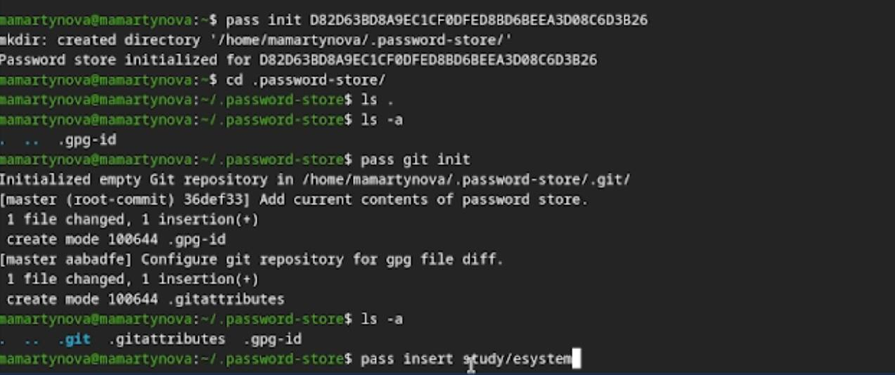

---
## Front matter
title: "Лабораторная работа №5"
author: "Мартынова Милана Александровна"

## Generic options
lang: ru-Ru\
toc-title: "Содержание"

## Bibliography
bibliography: bib/cite.bib
csl: pandoc/csl/gost-r-7-0-5-2008-numeric.csl

## Pdf output format
toc: true # Table of contents
toc-depth: 2
lof: true # List of figures
lot: true # List of tables
fontsize: 12pt
linestretch: 1.5
papersize: a4
documentclass: scrreprt
## I18n polyglossia
polyglossia-lang:
   name: russian
   options:
   - spelling=modern
   - babelshorhands=true
polyglossia-otherlangs:
   name: english
## I18n babel
babel-lang: russian
babel-otherlangs: english
## Fonts
## Fonts
mainfont: Times New Roman
sansfont: Arial
monofont: Courier New
mathfont: Times New Roman
## Biblatex
biblatex: true
biblio-style: "gost-numeric"
biblatexoptions:
   - parentracker=true
   - backend=biber
   - hyperref=auto
   - language=auto
   - autolang=other*
   - citestyle=gost-numeric
## Pandoc-crossref LaTeX customization
figureTitle: "Рис."
tableTitle: "Таблица"
listingTitle: "Листинг"
lofTitle: "Список иллюстраций"
lotTitle: "Список таблиц"
lolTitle: "Листинги"
## Misc options  
indent: true
header-includes:
  - \usepackage{indentfirst}
  - \usepackage{float} # keep figures where there are in the text
  - \floatplacement{figure}{H} # keep figures where there are in the text
---

# 1. Цель работы

Изучить и освоить работу с инструментами pass, gopass и chezmoi, а также механизм Native Messaging. Настроить их синхронизацию с удаленным Git-репозиторием.

# 2. Задание

- Установить дополнительное ПО
- Установить и настроить pass
- Настроить интерфейс с браузером
- Сохранить пароль
- Установить и настроить chezmoi
- Настроить chezmoi на новой машине
- Выполнить ежедневные операции с chezmoi

# 3. Теоретическое введение

pass реализует простой, но надежный подход Unix: пароли хранятся в виде набора зашифрованных GPG-файлов, разложенных по папкам. Это дает свободу в организации структуры паролей, но если вы планируете использовать сторонние графические оболочки или расширения, структуру нужно продумывать заранее.
chezmoi решает проблему синхронизации настроек (dotfiles). Он хранит эталонное состояние конфигов в отдельном каталоге (~/.local/share/chezmoi), который синхронизируется с Git. Особенность chezmoi в том, что он умеет не просто копировать файлы, а собирать их как конструктор: часть файлов копируется без изменений, а часть генерируется через шаблоны, подставляя данные из файла локальной конфигурации (chezmoi.toml). Это позволяет иметь, например, немного различающиеся настройки для рабочего и домашнего компьютера.

# 4. Выполнение лабораторной работы

Устанавливаю pass.(рис. 1)

{#fig:001 width=70%}

Инициаилизрую pass на машине и делаю первый пароль. (рис. 2)

{#fig:002 width=70%}

Устанавливаю дополнительное ПО и шрифты. (рис. 3)

{#fig:003 width=70%}

Инициализирую chezmoi с указанием на указанный в лабораторной работы репозиторий. (рис. 4)

{#fig:004 width=70%}

Проверяю изменения в удаленном репозитории (рис. 5)

{#fig:005 width=70%}

Отключаю автоматические сохранение изменений. (рис. 6)

{#fig:006 width=70%}

# 5. Выводы

В ходе работы были изучены и освоены утилиты pass, gopass и chezmoi, а также механизм Native Messaging. Выполнена настройка их интеграции с системами контроля версий (Git) для синхронизации данных и конфигураций.

# Список литературы{.unnumbered}

::: {#refs}
:::