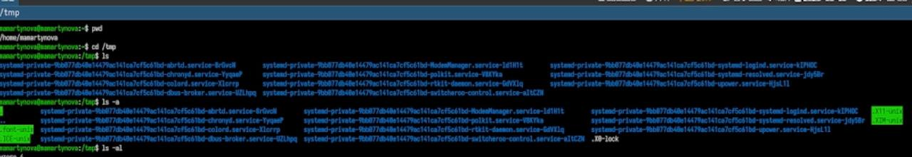
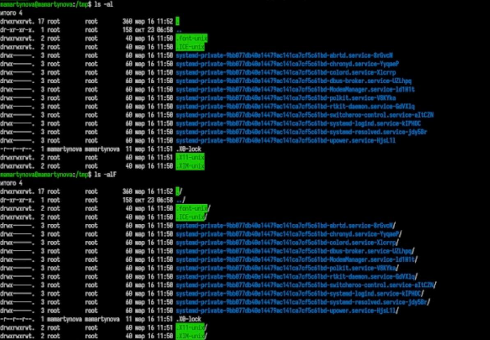
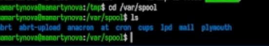
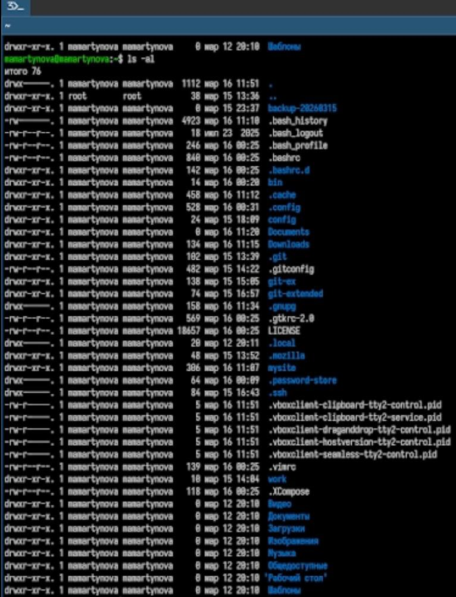
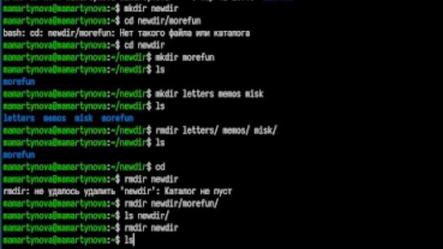
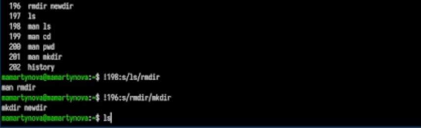

---
## Front matter
lang: ru-RU
title: Лабораторная работа №6
subtitle: Операционные системы
author:
  - Мартынова М.А.
institute:
  - Российский университет дружбы народов, Москва, Россия
date: 20 марта 2026

## i18n babel
babel-lang: russian
babel-otherlangs: english

## Formatting pdf
toc: false
toc-title: Содержание
slide_level: 2
aspectratio: 169
section-titles: true
theme: default
mainfont: Times New Roman
sansfont: Arial
---

# Информация

## Докладчик

:::::::::::::: {.columns align=center}
::: {.column width="70%"}

  * Мартынова Милана Александровна
  * Студент НКАбд-04-25
  * Российский университет дружбы народов
  * [1032253522@rudn.ru](mailto:1032253522@rudn.ru)

:::

::::::::::::::

# 1. Цель работы

Получение практических навыков работы в командной строке.

# 2. Задание

- Определите полное имя вашего домашнего каталога. Далее относительно этого ката-
лога будут выполняться последующие упражнения.
- Выполните следующие действия:
  - Перейдите в каталог /tmp.
  - Выведите на экран содержимое каталога /tmp. Для этого используйте команду ls с различными опциями Поясните разницу в выводимой на экран информации.
- Определите, есть ли в каталоге /var/spool подкаталог с именем cron?
- Перейдите в Ваш домашний каталог и выведите на экран его содержимое. Определите, кто является владельцем файлов и подкаталогов?

---

- Выполните следующие действия:
  - В домашнем каталоге создайте новый каталог с именем newdir.
  - В каталоге ~/newdir создайте новый каталог с именем morefun.
  - В домашнем каталоге создайте одной командой три новых каталога с именами letters, memos, misk. Затем удалите эти каталоги одной командой.
  - Попробуйте удалить ранее созданный каталог ~/newdir командой rm. Проверьте, был ли каталог удалён.
  - Удалите каталог ~/newdir/morefun из домашнего каталога. Проверьте, был ли
каталог удалён.

--- 

- С помощью команды man определите, какую опцию команды ls нужно использо-
вать для просмотра содержимое не только указанного каталога, но и подкаталогов,
входящих в него.
- С помощью команды man определите набор опций команды ls, позволяющий отсорти-
ровать по времени последнего изменения выводимый список содержимого каталога
с развёрнутым описанием файлов.
- Используйте команду man для просмотра описания следующих команд: cd, pwd, mkdir,
rmdir, rm. Поясните основные опции этих команд.
- Используя информацию, полученную при помощи команды history, выполните мо-
дификацию и исполнение нескольких команд из буфера команд.

# 3. Теоретическое введение

В операционных системах семейства Linux взаимодействие пользователя с системой реализуется через командную строку с использованием построчного ввода. Основным инструментом при этом выступают командные интерпретаторы (оболочки) языка shell, такие как /bin/sh, /bin/csh, /bin/ksh. Команда представляет собой текст, составленный по определенным правилам (включая аргументы), который служит указанием системе на выполнение той или иной функции. Структура команды обычно предполагает, что первым элементом указывается имя команды, а последующие элементы — аргументы или опции, уточняющие ее действие. Обобщенный синтаксис команды можно выразить следующим образом: <имя_команды><разделитель><аргументы>.

# 4. Выполнение лабораторной работы

Вывожу путь к домашнему каталогу, смотрю содержимое каталога tmp. (рис. 1)

{#fig:001 width=70%}

---

С разными флагами использую команду ls. (рис. 2)

{#fig:002 width=70%}

---

Проверяю, есть ли подкаталог cron в /var/spool. (рис. 3)

{#fig:003 width=70%}

---

Проверяю права доступа в домашнем каталоге. (рис. 4)

{#fig:004 width=70%}

---

Выполняю различные действия с папками. (рис. 5)

{#fig:005 width=70%}

---

Смотрю историю команд и изменяю некоторые.(рис. 6)

{#fig:006 width=70%}

# 5. Выводы

В ходе работы были приобретены практические навыки работы с системой посредством командной строки.