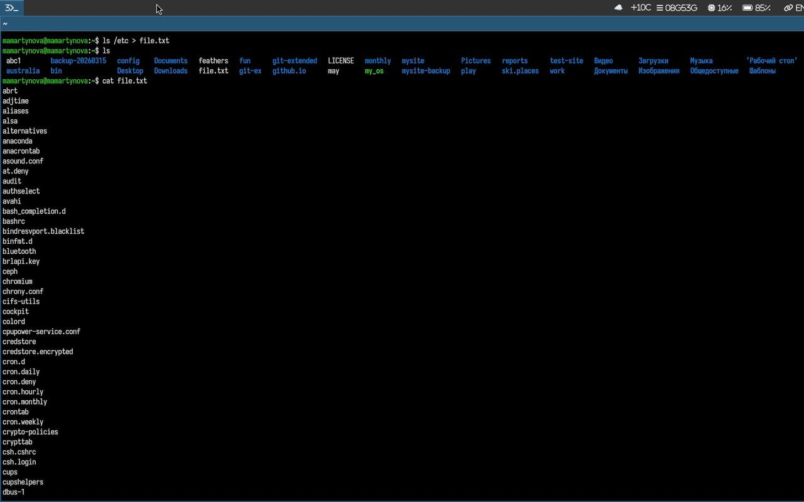
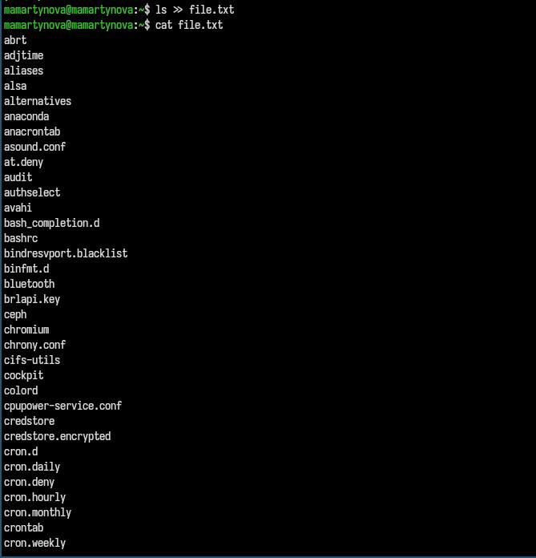
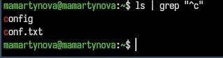
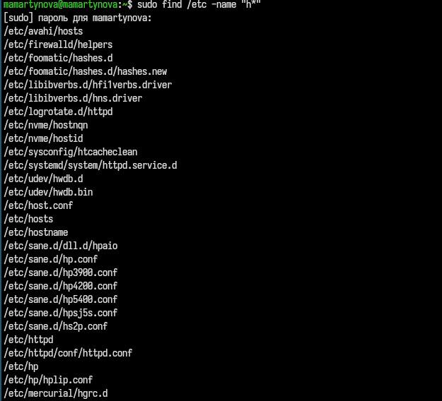
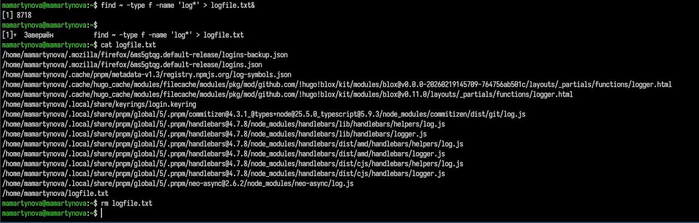
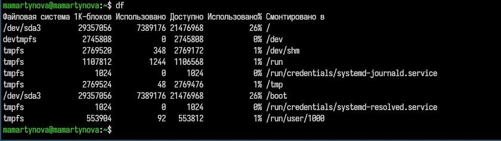

---
## Front matter
title: "Лабораторная работа №8"
author: "Мартынова Милана Александровна"

## Generic options
lang: ru-Ru\
toc-title: "Содержание"

## Bibliography
bibliography: bib/cite.bib
csl: pandoc/csl/gost-r-7-0-5-2008-numeric.csl

## Pdf output format
toc: true # Table of contents
toc-depth: 2
lof: true # List of figures
lot: true # List of tables
fontsize: 12pt
linestretch: 1.5
papersize: a4
documentclass: scrreprt
## I18n polyglossia
polyglossia-lang:
   name: russian
   options:
   - spelling=modern
   - babelshorhands=true
polyglossia-otherlangs:
   name: english
## I18n babel
babel-lang: russian
babel-otherlangs: english
## Fonts
## Fonts
mainfont: Times New Roman
sansfont: Arial
monofont: Courier New
mathfont: Times New Roman
## Biblatex
biblatex: true
biblio-style: "gost-numeric"
biblatexoptions:
   - parentracker=true
   - backend=biber
   - hyperref=auto
   - language=auto
   - autolang=other*
   - citestyle=gost-numeric
## Pandoc-crossref LaTeX customization
figureTitle: "Рис."
tableTitle: "Таблица"
listingTitle: "Листинг"
lofTitle: "Список иллюстраций"
lotTitle: "Список таблиц"
lolTitle: "Листинги"
## Misc options  
indent: true
header-includes:
  - \usepackage{indentfirst}
  - \usepackage{float} # keep figures where there are in the text
  - \floatplacement{figure}{H} # keep figures where there are in the text
---
# 1. Цель работы

Освоение инструментов поиска файлов и фильтрации текстовых данных, а также формирование практических навыков управления процессами и задачами, контроля дискового пространства и обслуживания файловых систем.

# 2. Задание

1. Осуществите вход в систему, используя соответствующее имя пользователя.
2. Запишите в файл file.txt названия файлов, содержащихся в каталоге /etc. Допи- шите в этот же файл названия файлов, содержащихся в вашем домашнем каталоге.
3. Выведите имена всех файлов из file.txt, имеющих расширение .conf, после чего запишите их в новый текстовой файл conf.txt.
4. Определите, какие файлы в вашем домашнем каталоге имеют имена, начинавшиеся с символа c? Предложите несколько вариантов, как это сделать.
5. Выведите на экран (по странично) имена файлов из каталога /etc, начинающиеся с символа h.
6. Запустите в фоновом режиме процесс, который будет записывать в файл ~/logfile файлы, имена которых начинаются с log.
7. Удалите файл ~/logfile.
8. Запустите из консоли в фоновом режиме редактор gedit.
9. Определите идентификатор процесса gedit, используя команду ps, конвейер и фильтр grep. Как ещё можно определить идентификатор процесса?
10. Прочтите справку (man) команды kill, после чего используйте её для завершения процесса gedit.
11. Выполните команды df и du, предварительно получив более подробную информацию об этих командах, с помощью команды man.
12. Воспользовавшись справкой команды find, выведите имена всех директорий, имею- щихся в вашем домашнем каталоге.

# 3. Теоретическое введение

В системе предусмотрено три стандартных потока ввода-вывода: stdin (0) — ввод с клавиатуры, stdout (1) — вывод на консоль, stderr (2) — вывод ошибок на консоль. Большинство консольных команд, таких как ls, направляют результат в stdout. Потоки можно перенаправлять с помощью символов >, >>, <, <<, а объединять команды в цепочки — через конвейер (|). Команда find служит для поиска файлов по заданному шаблону.

# 4. Выполнение лабораторной работы

Записываю в файл содержимое каталога. (рис. 1)

{#fig:001 width=70%}

Записываю в файл все файлы конфигурации.(рис. 2)

{#fig:002 width=70%}

Вывожу все файлы, начинающиеся на с.  (рис. 3)

{#fig:003 width=70%}

Вывожу все файлы, начинаеющиеся на h.(рис. 4)

{#fig:004 width=70%}

Записываю все логи в файл.(рис. 5)

{#fig:005 width=70%}

Открываю в фоне процесс и завершаю его. (рис. 6)

{#fig:006 width=70%}

Вывожу все директории домашнего каталога.(рис. 7)

{#fig:007 width=70%}

# 5. Выводы

В ходе работы были изучены инструменты поиска файлов и фильтрации текстовых данных, а также получены практические навыки управления процессами и задачами, контроля дискового пространства и обслуживания файловых систем.

# Список литературы{.unnumbered}

::: {#refs}
:::