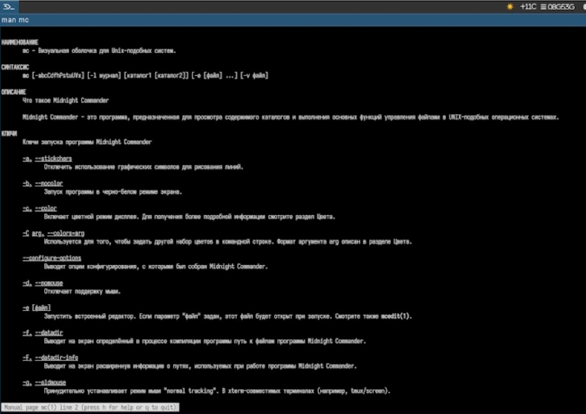
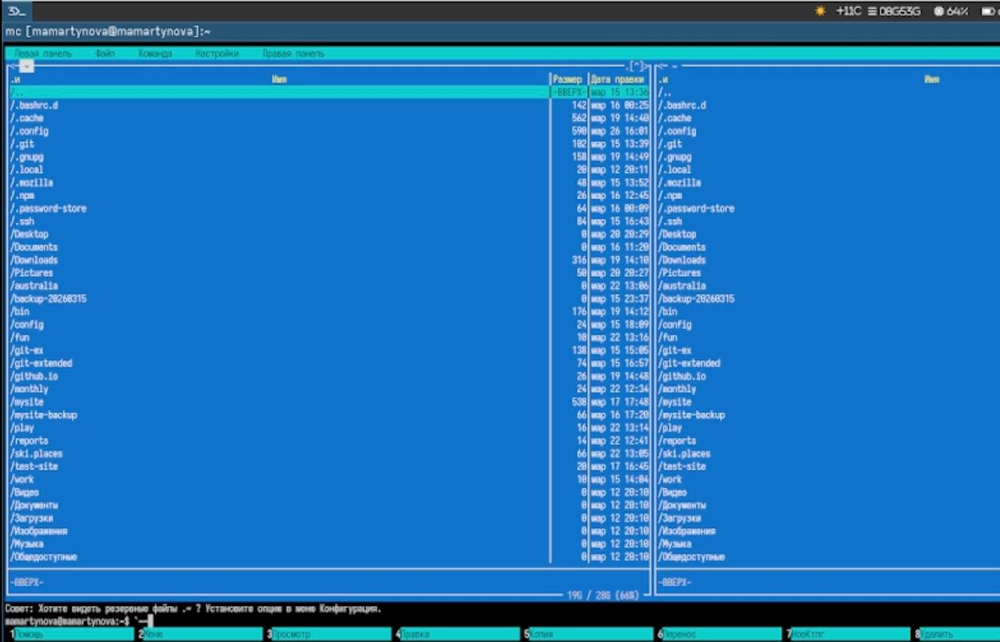
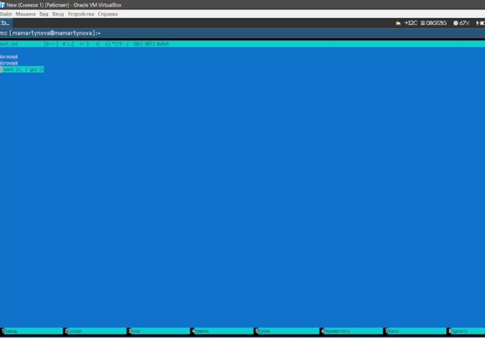
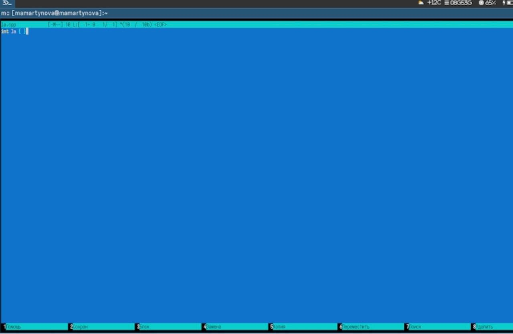

---
## Front matter
title: "Лабораторная работа №9"
author: "Мартынова Милана Александровна"

## Generic options
lang: ru-Ru\
toc-title: "Содержание"

## Bibliography
bibliography: bib/cite.bib
csl: pandoc/csl/gost-r-7-0-5-2008-numeric.csl

## Pdf output format
toc: true # Table of contents
toc-depth: 2
lof: true # List of figures
lot: true # List of tables
fontsize: 12pt
linestretch: 1.5
papersize: a4
documentclass: scrreprt
## I18n polyglossia
polyglossia-lang:
   name: russian
   options:
   - spelling=modern
   - babelshorhands=true
polyglossia-otherlangs:
   name: english
## I18n babel
babel-lang: russian
babel-otherlangs: english
## Fonts
## Fonts
mainfont: Times New Roman
sansfont: Arial
monofont: Courier New
mathfont: Times New Roman
## Biblatex
biblatex: true
biblio-style: "gost-numeric"
biblatexoptions:
   - parentracker=true
   - backend=biber
   - hyperref=auto
   - language=auto
   - autolang=other*
   - citestyle=gost-numeric
## Pandoc-crossref LaTeX customization
figureTitle: "Рис."
tableTitle: "Таблица"
listingTitle: "Листинг"
lofTitle: "Список иллюстраций"
lotTitle: "Список таблиц"
lolTitle: "Листинги"
## Misc options  
indent: true
header-includes:
  - \usepackage{indentfirst}
  - \usepackage{float} # keep figures where there are in the text
  - \floatplacement{figure}{H} # keep figures where there are in the text
---
# 1. Цель работы

Изучение базового функционала командной оболочки Midnight Commander. Формирование практических навыков работы с каталогами и файлами, включая их просмотр и выполнение операций над ними.

# 2. Задание

1. Изучите информацию о mc, вызвав в командной строке man mc.
2. Запустите из командной строки mc, изучите его структуру и меню.
3. Выполните несколько операций в mc, используя управляющие клавиши (операции с панелями; выделение/отмена выделения файлов, копирование/перемещение фай- лов, получение информации о размере и правах доступа на файлы и/или каталоги и т.п.)
4. Выполните основные команды меню левой (или правой) панели. Оцените степень подробности вывода информации о файлах.
5. Используя возможности подменю Файл , выполните: – просмотр содержимого текстового файла; – редактирование содержимого текстового файла (без сохранения результатов редактирования); – создание каталога; – копирование в файлов в созданный каталог.
6. С помощью соответствующих средств подменю Команда осуществите: – поиск в файловой системе файла с заданными условиями (например, файла с расширением .c или .cpp, содержащего строку main); – выбор и повторение одной из предыдущих команд; – переход в домашний каталог; – анализ файла меню и файла расширений.
7. Вызовите подменю Настройки . Освойте операции, определяющие структуру экрана mc (Full screen, Double Width, Show Hidden Files и т.д.)
8. Создайте текстовой файл text.txt.
9. Откройте этот файл с помощью встроенного в mc редактора.
10. Вставьте в открытый файл небольшой фрагмент текста, скопированный из любого другого файла или Интернета.
11. Проделайте с текстом следующие манипуляции, используя горячие клавиши: 4.1. Удалите строку текста. 4.2. Выделите фрагмент текста и скопируйте его на новую строку. 4.3. Выделите фрагмент текста и перенесите его на новую строку. 4.4. Сохраните файл. 4.5. Отмените последнее действие. 4.6. Перейдите в конец файла (нажав комбинацию клавиш) и напишите некоторый текст. 4.7. Перейдите в начало файла (нажав комбинацию клавиш) и напишите некоторый текст. 4.8. Сохраните и закройте файл.
12. Откройте файл с исходным текстом на некотором языке программирования (напри- мер C или Java)
13. Используя меню редактора, включите подсветку синтаксиса, если она не включена, или выключите, если она включена.

# 3. Теоретическое введение

Командная оболочка представляет собой интерфейс, через который пользователь взаимодействует с операционной системой и программами, вводя команды. Midnight Commander (сокращённо mc) — это псевдографическая оболочка, работающая в UNIX/Linux. Чтобы запустить mc, достаточно ввести в командной строке mc и нажать Enter. Рабочая область Midnight Commander разделена на две панели, которые по умолчанию показывают содержимое двух разных каталогов.

# 4. Выполнение лабораторной работы

Читаю справку. (рис. 1)

{#fig:001 width=70%}

Ознакамливаюсь с интерфейсом mc.(рис. 2)

{#fig:002 width=70%}

Изучаю встроенный редактор mc.(рис. 3)

{#fig:003 width=70%}

Изучаю особенности редактирования кода, подсвечивание синтаксиса.(рис. 4)

{#fig:004 width=70%}

# 5. Выводы

Нами были изучены ключевые функции командной оболочки Midnight Commander. Мы получили практические умения, необходимые для просмотра каталогов и файлов, а также для выполнения различных операций над ними.

# Список литературы{.unnumbered}

::: {#refs}
:::