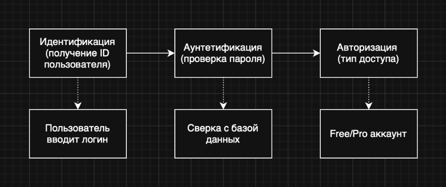
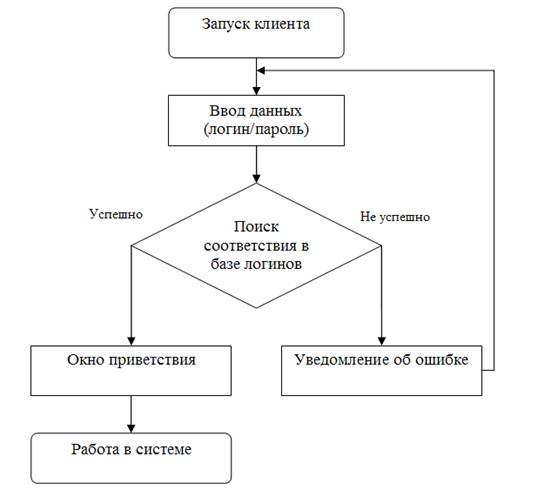
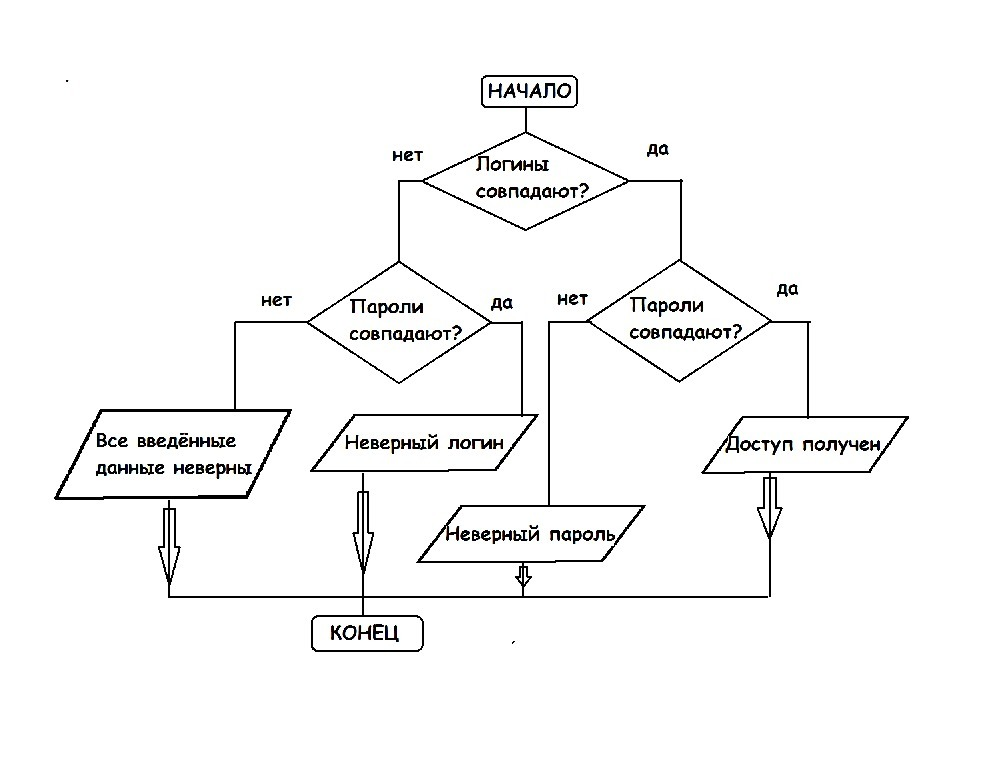
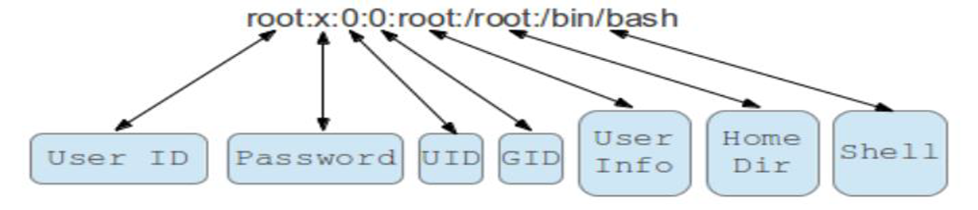
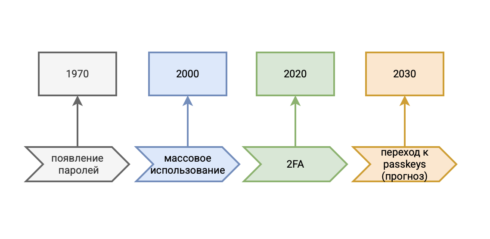

---
## Front matter
lang: ru-RU
title: Схема аутентификации пользователей с помощью логинов и паролей
subtitle: Операционные системы
author:
  - Мартынова М.А.
institute:
  - Российский университет дружбы народов, Москва, Россия
date: 31 марта 2026

## i18n babel
babel-lang: russian
babel-otherlangs: english

## Formatting pdf
toc: false
toc-title: Содержание
slide_level: 2
aspectratio: 169
section-titles: true
theme: default
mainfont: Times New Roman
sansfont: Arial
---

# Информация

## Докладчик

:::::::::::::: {.columns align=center}
::: {.column width="70%"}

  * Мартынова Милана Александровна
  * Студент НКАбд-04-25
  * Российский университет дружбы народов
  * [1032253522@rudn.ru](mailto:1032253522@rudn.ru)

:::

::::::::::::::

# Объект и предмет

- **Объект исследования** – процесс аутентификации пользователей в компьютерных системах.  
- **Предмет исследования** – схема «логин – пароль», её реализация в UNIX и методы повышения защищённости.  

# Цель работы

- Цель работы – систематизировать знания, выявить уязвимости, проанализировать реализацию в UNIX и оценить актуальность.  

# Задачи

- Описать теоретическую основу аутентификации, её место в триаде «идентификация – аутентификация – авторизация».
- Представить классическую схему «логин – пароль», включая этапы регистрации, входа, хранения и проверки паролей.
- Проанализировать реализацию этой схемы в операционной системе UNIX (процесс `getty` → `login`, файлы `/etc/passwd` и `/etc/shadow`, механизмы SetUID, sticky bit, ограничения сеанса).
- Оценить актуальность парольной аутентификации в условиях современных угроз и технологических альтернатив.
- Сформулировать практические рекомендации по безопасной реализации парольной схемы.

# Актульность

На сегодняшний день, несмотря на бурное развитие биометрии, аппаратных токенов (YubiKey, TPM) и беcпарольных технологий (WebAuthn, FIDO2), схема «логин – пароль» остаётся доминирующим методом аутентификации в корпоративных, образовательных и пользовательских системах.

# Триада: идентификация – аутентификация – авторизация

{#fig:001 width=70%}

# Общая схема «логин – пароль» 

1. **Регистрация** – пользователь задаёт пароль, система хэширует его и сохраняет хэш (желательно с «солью»).  
2. **Хранение** – только хэш, никогда открытый пароль.  
3. **Вход** – ввод логина и пароля, система хэширует введённый пароль и сравнивает с сохранённым.  
4. При совпадении – доступ разрешён.

{#fig:002 width=30%}

# Уязвимости парольной схемы и методы защиты

| Уязвимость | Метод защиты |
|-------------|---------------|
| Слабый пароль (перебор) | Политика сложности, менеджеры паролей |
| Перехват при передаче | Шифрование (TLS, SSH) |
| Утечка базы хэшей | Соль, медленные хэши (bcrypt, Argon2) |
| Фишинг | Двухфакторная аутентификация (2FA) |
| Повторное использование паролей | Генератор случайных паролей в менеджере |

# Реализация в UNIX: модель безопасности

- **Номинальный субъект** – учётная запись (логин).  
- **Действительный субъект** – процесс с UID/GID пользователя.  
- **Объект** – файл, каталог, устройство.  
- Три права доступа: **r** (чтение), **w** (запись), **x** (исполнение/вход).

# Процесс входа в UNIX (getty → login)

1. **getty** – ожидает активности на терминале.  
2. Пользователь вводит **логин** → запускается **login**.  
3. **login** запрашивает пароль, проверяет хэш (через `/etc/shadow`).  
4. При успехе – запускается **shell** с UID/GID пользователя.  
5. Все процессы наследуют эти UID/GID.

{#fig:003 width=40%}

# Хранение учётных данных в UNIX

- **`/etc/passwd`** – общедоступен, содержит логин, UID, GID, домашний каталог, shell. Поле пароля заменено на `x`.  
- **`/etc/shadow`** – доступен только root, содержит хэш пароля с солью.  
- Пример строки в `/etc/passwd`:  `root:x:0:0:root:/root:/bin/bash`

{#fig:004 width=70%}

# Дополнительные механизмы безопасности UNIX

| Механизм | Назначение |
|-----------|-------------|
| **SetUID** | Временное получение прав владельца файла (например, `passwd`). |
| **Sticky bit** | В общем каталоге пользователь удаляет только свои файлы. |
| **Ограничения входа** | По времени, адресу, типу терминала (`/etc/login.access`). |
| **Дисковые квоты** | Ограничение места и числа файлов. |

# Актуальность паролей сегодня + 2FA и менеджеры

- **2FA** (пароль + одноразовый код) – обязательный стандарт для почты, банков, соцсетей.  
- **Менеджеры паролей** (Bitwarden, KeePass) – позволяют иметь уникальные сложные пароли без запоминания.  
- **Беcпарольные методы** (WebAuthn, passkeys) – будущее, но пароль остаётся запасным вариантом.  
- В UNIX – **PAM** позволяет подключать любые методы (от пароля до смарт-карты).

{#fig:005 width=40%}

# Парольная аутентификация – фундамент, но она **недостаточна** без соли, медленных хэшей и 2FA.  
- UNIX предоставляет эталонную реализацию: `/etc/shadow`, чёткий процесс `getty → login`.  
- **Рекомендации:**  
  - Для веб-сервисов: bcrypt/Argon2 + 2FA.  
  - Для UNIX: `/etc/shadow`, PAM с защитой от перебора.  
  - Для пользователей: менеджеры паролей.  
- **Перспектива:** пароли останутся ещё 5–7 лет как резервный метод.

