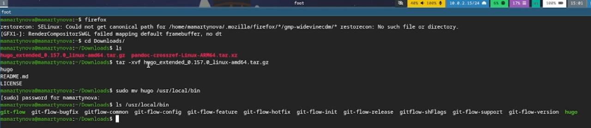
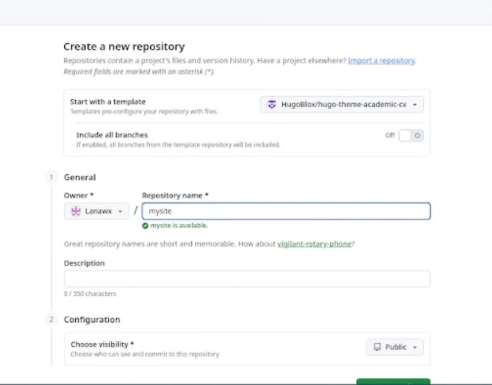
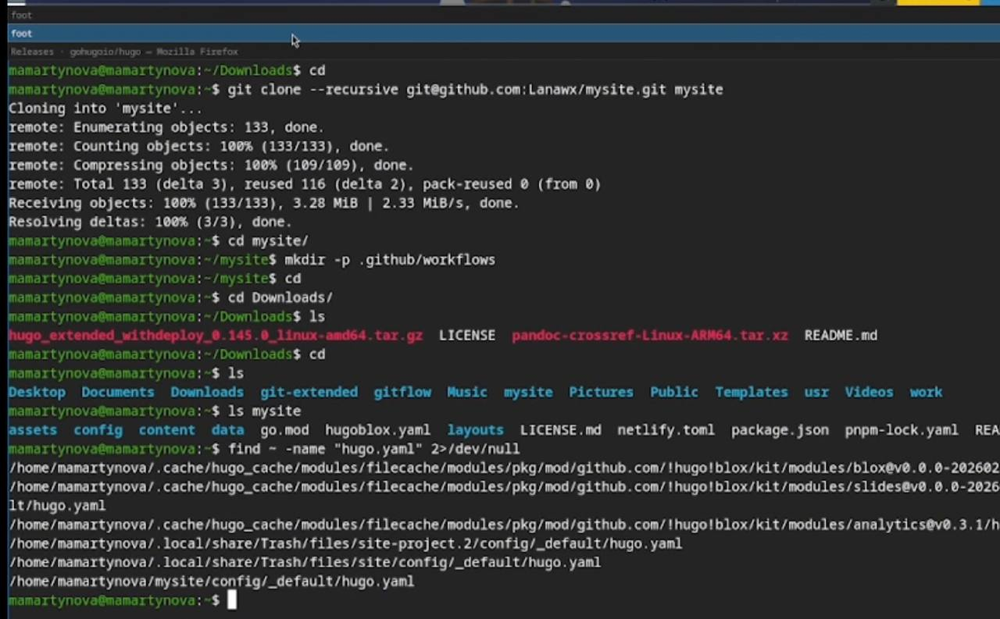
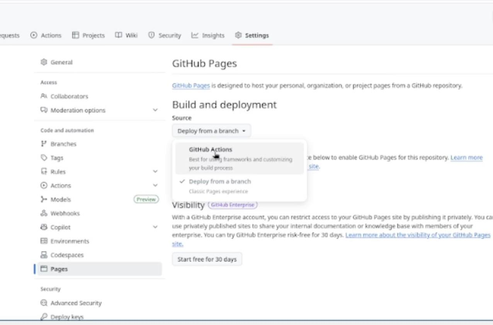
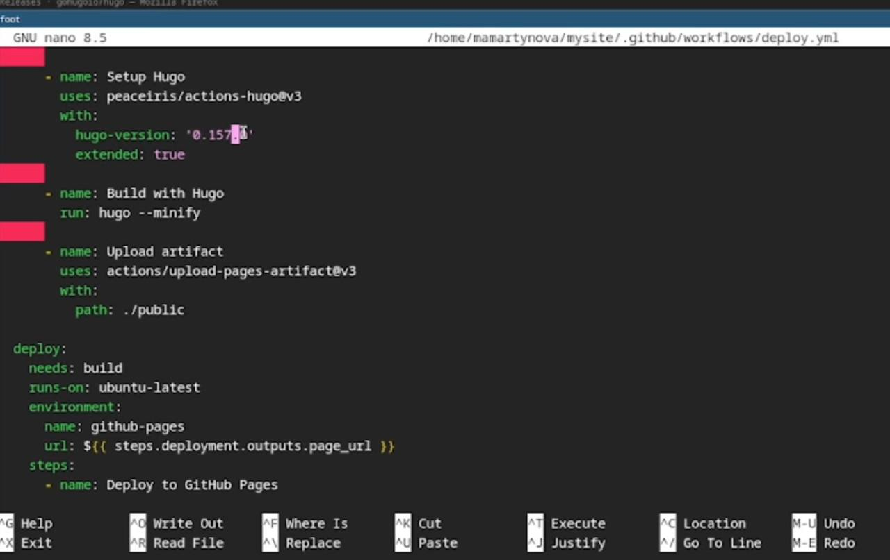
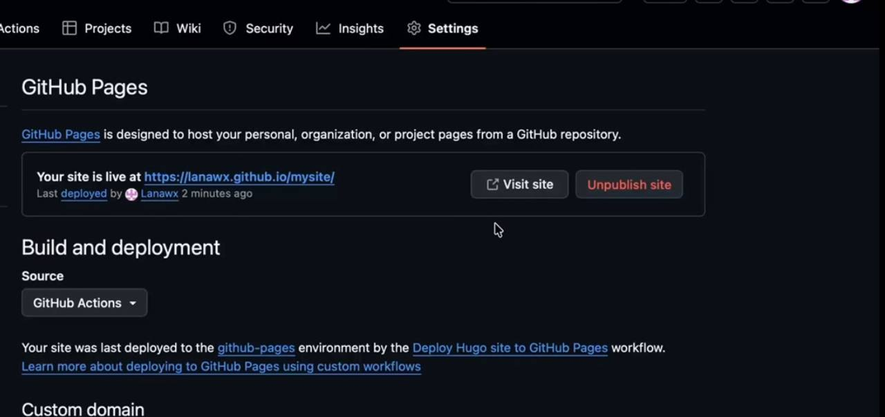

---
## Front matter
lang: ru-RU
title: Индивидуальный проект 1 этап
subtitle: Операционные системы
author:
  - Мартынова М.А.
institute:
  - Российский университет дружбы народов, Москва, Россия
date: 28 февраля 2026

## i18n babel
babel-lang: russian
babel-otherlangs: english

## Formatting pdf
toc: false
toc-title: Содержание
slide_level: 2
aspectratio: 169
section-titles: true
theme: default
mainfont: Times New Roman
sansfont: Arial
---

# Информация

## Докладчик

:::::::::::::: {.columns align=center}
::: {.column width="70%"}

  * Мартынова Милана Александровна
  * Студент НКАбд-04-25
  * Российский университет дружбы народов
  * [1032253522@rudn.ru](mailto:1032253522@rudn.ru)

:::

::::::::::::::

# 1. Цель работы

Научиться размещать свой сайт на Github pages. Выполнить первый этап индивидуального проекта.

# 2. Задание

- Установка необходимого ПО
- Скачивание шаблона темы сайта
- Размещение его на хостинге Git
- Установка параметра для URL сайта
- Размещение загатовки сайта на Github pages

# 3. Выполнение лабораторной работы

Устанавливаю hugo на свою виртуальную машину и переношу исполняемый файл в директорию с пакетами. (рис. 1)

{#fig:001 width=70%}

---

Создаю свой репозиторий для будущего сайта, используя шаблон.(рис. 2)

{#fig:002 width=70%}

---

Клонирую репозиторий на свою машину и загружаю туда конфигурационный файл для сайта. (рис. 3)

{#fig:003 width=70%}

---

Делаю снимок изменений, создаю коммит и отправляю изменения на github.(рис. 4)

{#fig:004 width=70%}

---

В настройках репозитория указываю github actions.(рис. 5)

{#fig:005 width=70%}

---

Исправляю код файла workflows, так как cайт не запустился. (рис. 6)

{#fig:006 width=70%}

---

Теперь сайт появился.(рис. 7)

{#fig:007 width=70%}

# 4. Выводы

В ходе выполнения первого этапа индивидуального проекта мы научились размещать сайт на Github pages.