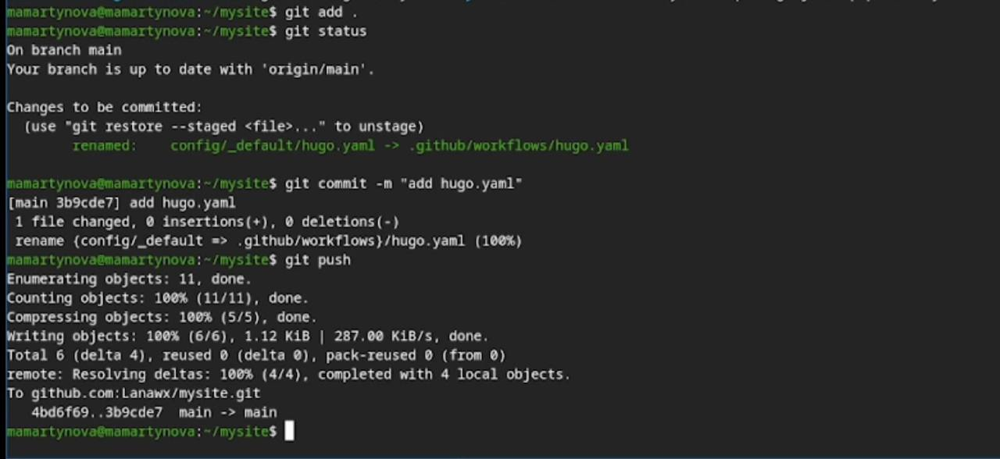

---
## Front matter
title: "Индивидуальный проект 1 этап"
author: "Мартынова Милана Александровна"

## Generic options
lang: ru-Ru\
toc-title: "Содержание"

## Bibliography
bibliography: bib/cite.bib
csl: pandoc/csl/gost-r-7-0-5-2008-numeric.csl

## Pdf output format
toc: true # Table of contents
toc-depth: 2
lof: true # List of figures
lot: true # List of tables
fontsize: 12pt
linestretch: 1.5
papersize: a4
documentclass: scrreprt
## I18n polyglossia
polyglossia-lang:
   name: russian
   options:
   - spelling=modern
   - babelshorhands=true
polyglossia-otherlangs:
   name: english
## I18n babel
babel-lang: russian
babel-otherlangs: english
## Fonts
## Fonts
mainfont: Times New Roman
sansfont: Arial
monofont: Courier New
mathfont: Times New Roman
## Biblatex
biblatex: true
biblio-style: "gost-numeric"
biblatexoptions:
   - parentracker=true
   - backend=biber
   - hyperref=auto
   - language=auto
   - autolang=other*
   - citestyle=gost-numeric
## Pandoc-crossref LaTeX customization
figureTitle: "Рис."
tableTitle: "Таблица"
listingTitle: "Листинг"
lofTitle: "Список иллюстраций"
lotTitle: "Список таблиц"
lolTitle: "Листинги"
## Misc options  
indent: true
header-includes:
  - \usepackage{indentfirst}
  - \usepackage{float} # keep figures where there are in the text
  - \floatplacement{figure}{H} # keep figures where there are in the text
---
# 1. Цель работы

Научиться размещать свой сайт на Github pages. Выполнить первый этап индивидуального проекта.

# 2. Задание

- Установка необходимого ПО
- Скачивание шаблона темы сайта
- Размещение его на хостинге Git
- Установка параметра для URL сайта
- Размещение загатовки сайта на Github pages

# 3. Выполнение лабораторной работы

Устанавливаю hugo на свою виртуальную машину и переношу исполняемый файл в директорию с пакетами. (рис. 1)

{#fig:001 width=70%}

Создаю свой репозиторий для будущего сайта, используя шаблон.(рис. 2)

{#fig:002 width=70%}

Клонирую репозиторий на свою машину и загружаю туда конфигурационный файл для сайта. (рис. 3)

{#fig:003 width=70%}

Делаю снимок изменений, создаю коммит и отправляю изменения на github.(рис. 4)

{#fig:004 width=70%}

В настройках репозитория указываю github actions.(рис. 5)

{#fig:005 width=70%}

Исправляю код файла workflows, так как cайт не запустился. (рис. 6)

{#fig:006 width=70%}

Теперь сайт появился.(рис. 7)

{#fig:007 width=70%}

# 4. Выводы

В ходе выполнения первого этапа индивидуального проекта мы научились размещать сайт на Github pages.

# Список литературы{.unnumbered}

::: {#refs}
:::