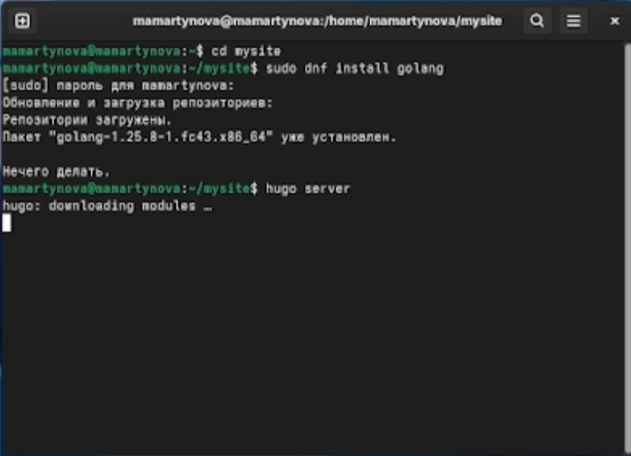
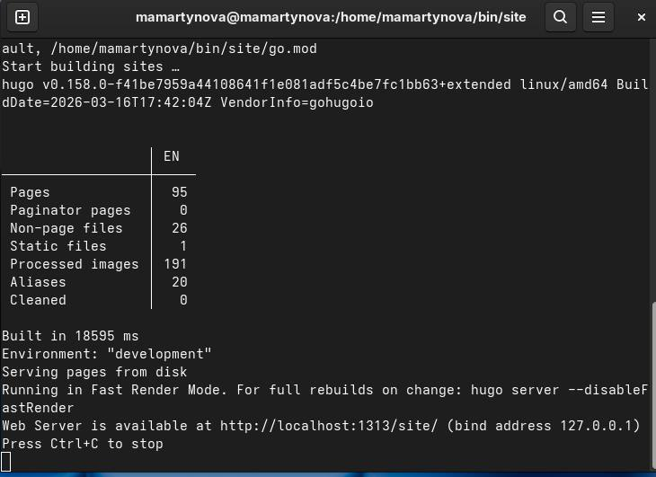
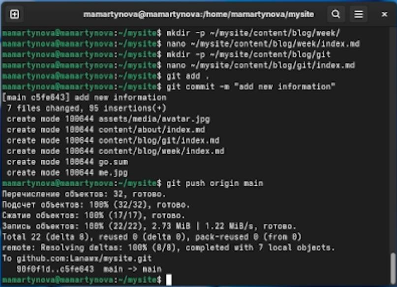
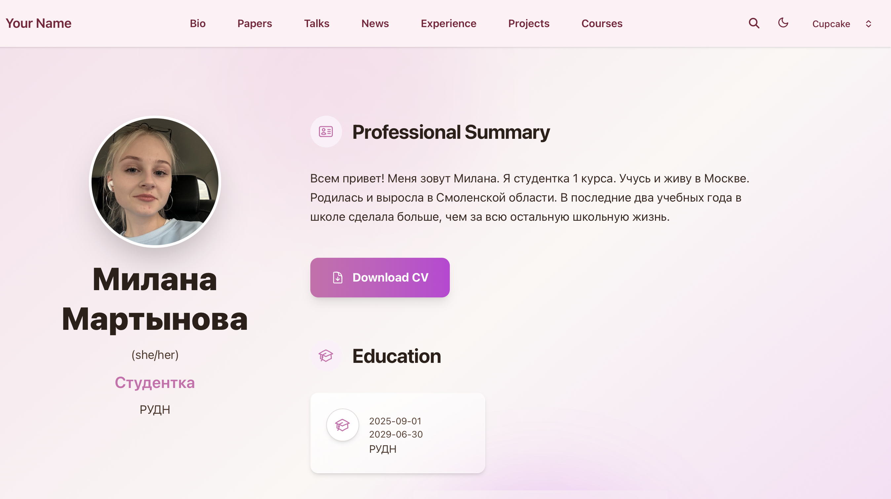

---
## Front matter
lang: ru-RU
title: Индивидуальный проект 2 этап
subtitle: Операционные системы
author:
  - Мартынова М.А.
institute:
  - Российский университет дружбы народов, Москва, Россия
date: 20 марта 2026

## i18n babel
babel-lang: russian
babel-otherlangs: english

## Formatting pdf
toc: false
toc-title: Содержание
slide_level: 2
aspectratio: 169
section-titles: true
theme: default
mainfont: Times New Roman
sansfont: Arial
---

# Информация

## Докладчик

:::::::::::::: {.columns align=center}
::: {.column width="70%"}

  * Мартынова Милана Александровна
  * Студент НКАбд-04-25
  * Российский университет дружбы народов
  * [1032253522@rudn.ru](mailto:1032253522@rudn.ru)

:::

::::::::::::::

# 1. Цель работы

Осуществить дальнейшую работу с сайтом, привести его в соответствие с установленными требованиями и разместить на нем личные данные.

# 2. Задание

- Разместить фотографию владельца сайта.
- Разместить краткое описание владельца сайта (Biography).
- Добавить информацию об интересах (Interests).
- Добавить информацию от образовании (Education).
- Сделать пост по прошедшей неделе.
- Добавить пост на тему по выбору: Управление версиями. Git. Непрерывная интеграция и непрерывное развертывание (CI/CD).

# 3. Выполнение лабораторной работы

Скачиваю язык go для того чтобы изменения на сайте можно было тестировать локально. (рис. 1)

{#fig:001 width=70%}

---

Проверка запуска сайта на виртуальной машине. (рис. 2)

{#fig:002 width=70%}

---

Загружаю в директорию сайта измененый файл с биографией и два поста. (рис. 3)

{#fig:003 width=70%}

---

Проверка изменений на сайте. (рис. 4)

{#fig:004 width=70%}

# 4. Выводы

В ходе работы над сайтом были осуществлены его доработка согласно установленным требованиям и внесение информации о себе.