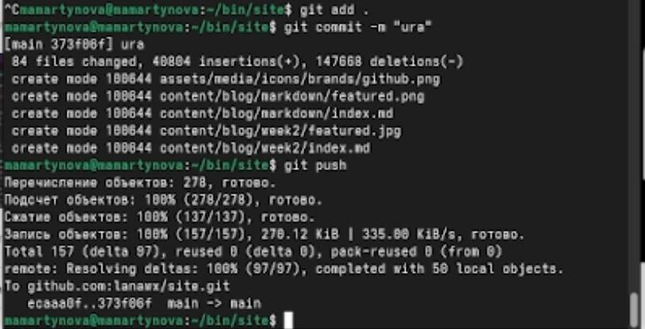
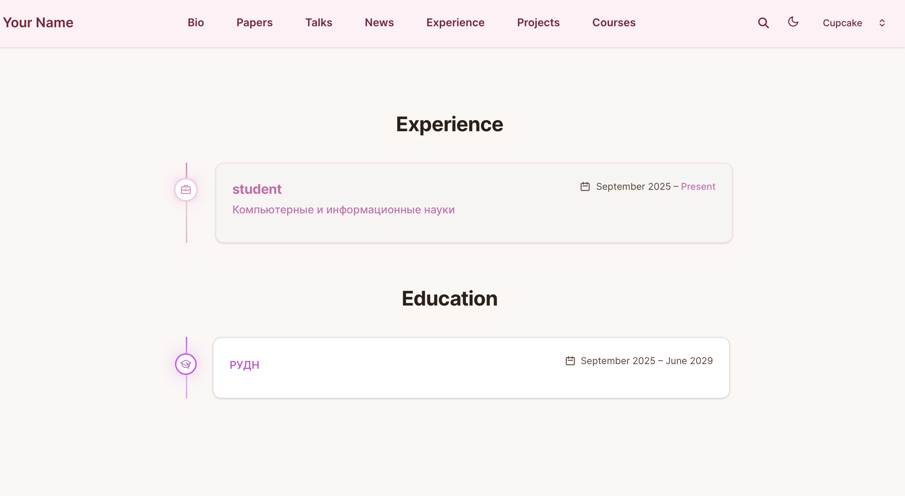
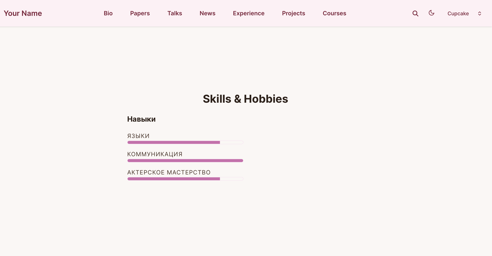
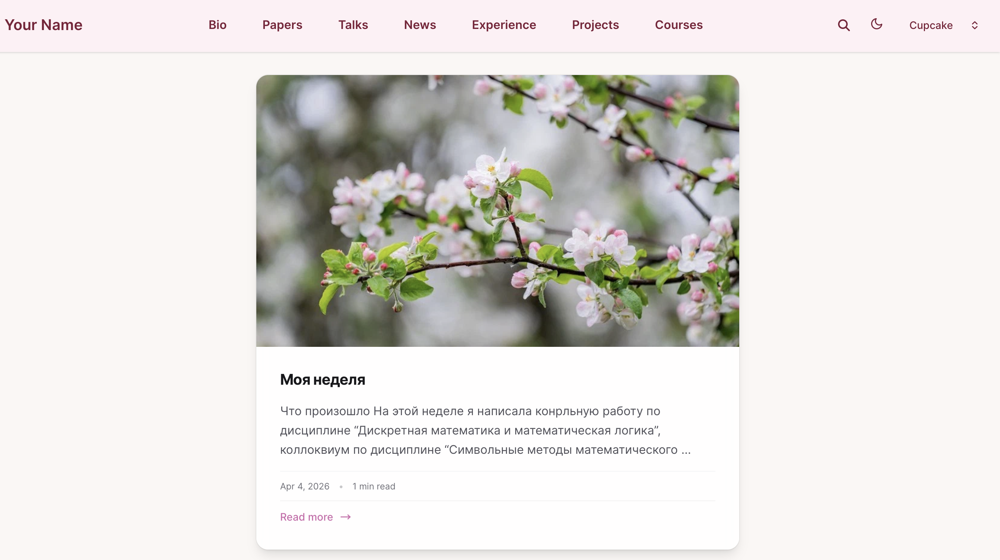
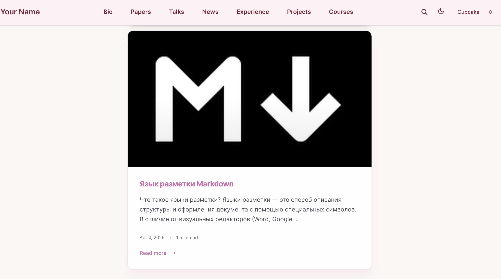

---
## Front matter
lang: ru-RU
title: Индивидуальный проект 3 этап
subtitle: Операционные системы
author:
  - Мартынова М.А.
institute:
  - Российский университет дружбы народов, Москва, Россия
date: 4 апреля 2026

## i18n babel
babel-lang: russian
babel-otherlangs: english

## Formatting pdf
toc: false
toc-title: Содержание
slide_level: 2
aspectratio: 169
section-titles: true
theme: default
mainfont: Times New Roman
sansfont: Arial
---

# Информация

## Докладчик

:::::::::::::: {.columns align=center}
::: {.column width="70%"}

  * Мартынова Милана Александровна
  * Студент НКАбд-04-25
  * Российский университет дружбы народов
  * [1032253522@rudn.ru](mailto:1032253522@rudn.ru)

:::

::::::::::::::

# 1. Цель работы

Продолжить работу с сайтом, добавить личные достижения и два новых поста

# 2. Задание

1. Добавить информацию о навыках (Skills).
2. Добавить информацию об опыте (Experience).
3. Добавить информацию о достижениях (Accomplishments).
4. Сделать пост по прошедшей неделе.
5. Добавить пост на тему по выбору: Легковесные языки разметки. Языки разметки. LaTeX. Язык разметки Markdown.

# 3. Выполнение лабораторной работы

Отправляю изменения в GitHub. (рис. 1)

{#fig:001 width=70%}

---

Проверяю изменения на сайте:

Проверяю добавление опыта. (рис. 2)

{#fig:002 width=70%}

---

Проверяю добавление навыков. (рис. 3)

{#fig:003 width=70%}

---

Проверяю добавление наград. (рис. 4)

{#fig:004 width=70%}

---

Проверяю добавление поста о прошедшей неделе. (рис. 5)

{#fig:005 width=70%}

---

Проверяю добавление поста про MarkDown. (рис. 6)

{#fig:006 width=70%}

# 4. Выводы

Мы продолжили работу с сайтом, добавили личные достижения.