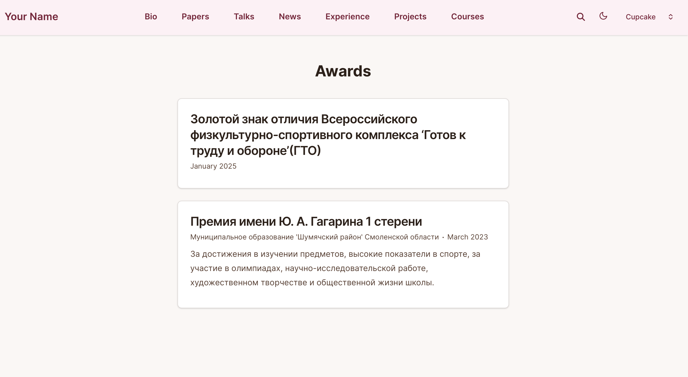

---
## Front matter
title: "Индивидуальный проект 3 этап"
author: "Мартынова Милана Александровна"

## Generic options
lang: ru-Ru\
toc-title: "Содержание"

## Bibliography
bibliography: bib/cite.bib
csl: pandoc/csl/gost-r-7-0-5-2008-numeric.csl

## Pdf output format
toc: true # Table of contents
toc-depth: 2
lof: true # List of figures
lot: true # List of tables
fontsize: 12pt
linestretch: 1.5
papersize: a4
documentclass: scrreprt
## I18n polyglossia
polyglossia-lang:
   name: russian
   options:
   - spelling=modern
   - babelshorhands=true
polyglossia-otherlangs:
   name: english
## I18n babel
babel-lang: russian
babel-otherlangs: english
## Fonts
## Fonts
mainfont: Times New Roman
sansfont: Arial
monofont: Courier New
mathfont: Times New Roman
## Biblatex
biblatex: true
biblio-style: "gost-numeric"
biblatexoptions:
   - parentracker=true
   - backend=biber
   - hyperref=auto
   - language=auto
   - autolang=other*
   - citestyle=gost-numeric
## Pandoc-crossref LaTeX customization
figureTitle: "Рис."
tableTitle: "Таблица"
listingTitle: "Листинг"
lofTitle: "Список иллюстраций"
lotTitle: "Список таблиц"
lolTitle: "Листинги"
## Misc options  
indent: true
header-includes:
  - \usepackage{indentfirst}
  - \usepackage{float} # keep figures where there are in the text
  - \floatplacement{figure}{H} # keep figures where there are in the text
---
# 1. Цель работы

Продолжить работу с сайтом, добавить личные достижения и два новых поста

# 2. Задание

1. Добавить информацию о навыках (Skills).
2. Добавить информацию об опыте (Experience).
3. Добавить информацию о достижениях (Accomplishments).
4. Сделать пост по прошедшей неделе.
5. Добавить пост на тему по выбору: Легковесные языки разметки. Языки разметки. LaTeX. Язык разметки Markdown.

# 3. Выполнение лабораторной работы

Отправляю изменения в GitHub. (рис. 1)

{#fig:001 width=70%}

Проверяю изменения на сайте:

Проверяю добавление опыта. (рис. 2)

{#fig:002 width=70%}

Проверяю добавление навыков. (рис. 3)

{#fig:003 width=70%}

Проверяю добавление наград. (рис. 4)

{#fig:004 width=70%}

Проверяю добавление поста о прошедшей неделе. (рис. 5)

{#fig:005 width=70%}

Проверяю добавление поста про MarkDown. (рис. 6)

{#fig:006 width=70%}

# 4. Выводы

Мы продолжили работу с сайтом, добавили личные достижения.

# Список литературы{.unnumbered}

::: {#refs}
:::